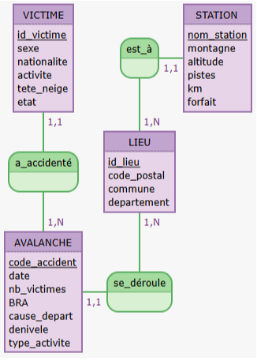

```{r setup, include=FALSE}
knitr::opts_chunk$set(echo = FALSE)

#Connexion locale - adapter host/username/password selon votre config
library(DBI)
con <- DBI::dbConnect(
  drv = RMySQL::MySQL(),    # database driver à utiliser
  host = "localhost", 
  port = 3306, 
  username = "root", 
  password = "",
  dbname = "avalanchaine"
)

library(ggplot2) #on appelle ggplot2
library(sf) #pour les cartes
library(dplyr) #pour les cartes et les boxplot


#FONCTIONS

#effectue le test de corrélation linéaire
test_correlation <- function(tableau, var1, var2){
  var1 <- tableau[[var1]]
  var2 <- tableau[[var2]]
  
  r <- cor(x=var1,y= var2)
  print("Coefficient de corrélation :")
  print(r)
  r_carre <- r^2
  
  effectuer <- TRUE
  
  if (r_carre<0.3){
    print("La relation est faible ou non existante")
    effectuer <- FALSE
    }else if (r_carre<0.7){print("La relation est moyennenement forte")}else{print("La relation est forte")}
  
  if(effectuer){
    alpha <- 0.05
    seuil <- qnorm(1-alpha/2) #quantile à 5% de la loi N(0,1)
    stat_test <- seuil/sqrt(nrow(tableau)-1)
    if (abs(r)<stat_test) {
      print("On ne rejette pas l'hypothèse H.")
      print("On peut donc affirmer avec un risque de 5% que les variables ne sont pas corrélées.")
    } else {
      print("On rejette l'hypothèse H.")
      print("On peut donc affirmer avec un risque de 5% que les variables sont corrélées.")
    }
  }
}

#Fonction qui rajoute une colonne période
date_periode <- function(tableau) {
  tableau$date <- as.Date(tableau$date)
  tableau$annee <- as.numeric(format(tableau$date, "%Y"))
  tableau$periode <- ifelse(tableau$annee <= 2005, "2000-2005",
                        ifelse(tableau$annee <= 2011, "2006-2011",
                        ifelse(tableau$annee <= 2017, "2012-2017", "2018-2023")))
  return(tableau)
}

#Fonction qui fait le test du khi2 (il faut mettre les noms de variables entre "")
test_khi2 <- function(tableau,variable1,variable2){
  
#tableau de contingence
table_conting <- table(tableau[[variable1]], tableau[[variable2]])
#khi2
khi2<-chisq.test(tableau[[variable1]], tableau[[variable2]])

effectuer <- TRUE

if (nrow(tableau)>3){test_1<-TRUE}else{test_1<-FALSE}
eff_theo <- khi2$expected
(eff_theo)
nb_sup_cinq <- sum(eff_theo>=5)
nb_cases <- length(eff_theo)
proportion <- nb_sup_cinq/nb_cases
(proportion)
if (proportion>=0.8){test_2<-TRUE}else{test_2<-FALSE}
if(test_1 == TRUE & test_2 == TRUE){print("Le test est valide")}else{
  print("Le test n'est pas valide")
  effectuer <- FALSE
  }

if (effectuer){
  df <- (nrow(table_conting)-1)*(ncol(table_conting)-1)
  alpha <- 0.05
  if(khi2$statistic>pchisq(df,1-alpha)){ print("On rejette l'hypothèse.")
    print("On peut donc affirmer que les variables sont dépendantes au risque de 5 %.")
  }else{ print("On ne rejette pas l'hypothèse.")
    print("On peut affirmer que les variables sont indépendantes au risque de 5 %.")}
  }

}


#dispersion inter
disinter <- function(quanti, quali) {
moyennes <- tapply(quanti, quali, mean)
effectifs <- tapply(quanti, quali, length)
res <- (sum(effectifs * (moyennes - mean(quanti))^2))
return(res)
}

#dispersion intra
disintra <- function(quanti, quali) {
effectifs <- tapply(quanti, quali, length)
varest <- tapply(quanti, quali, var)
varest[is.na(varest)] <- 0
return(sum((effectifs - 1) * varest))
}

#effectue le test d'ANOVA
test_anova <- function(tableau, quanti, quali){
  var_quanti <- tableau[[quanti]]
  var_quali <- tableau[[quali]]
  K <-length(unique(var_quali))
  #Stat de test
  stat_test <- (nrow(tableau)-K) * disinter(var_quanti,var_quali)/(disintra(var_quanti,var_quali))
  seuil <- qchisq(0.95, df = K-1)
  if (stat_test<seuil){print("On ne rejette pas l'hypothèse H.")
    print("On peut affirmer au risque de 5% qu'il n'y a pas de différence significative.")}else{print("On rejette l'hypothèse H.")
      print("On peut affirmer au risque de 5% qu'il y a une différence significative.")}
}
```

# Introduction

En France, les avalanches en montagne sont un risque bien réel. En effet, elles peuvent causer des dégâts matériels, mais aussi malheureusement des pertes humaines. Cet hiver encore, comme le dit [cet article,](https://france3-regions.francetvinfo.fr/auvergne-rhone-alpes/haute-savoie/chamonix/un-guide-de-haute-montagne-retrouve-mort-dans-une-avalanche-en-haute-savoie-nous-avions-l-espoir-de-le-retrouver-vivant-3103264.html?utm_source=chatgpt.com) un guide de haute montagne est décédé après avoir été emporté par une avalanche dans le massif du Mont-Blanc en Haute-Savoie. Mais il y a aussi eu 20 autres victimes d’après l’[ANENA](https://anena.org/accidents/accidents-avalanche-de-la-saison/) entre le 1er janvier et le 2 mai 2025\. C’est en sachant cela que nous avons décidé d’orienter le sujet de notre étude vers les avalanches et leurs risques. Nous allons donc nous demander : 

**Où se déclarent les avalanches les plus dangereuses et de quelles stations elles sont les plus proches en France entre 2000 et 2023 ?**

En effet, cette question est importante, à la fois pour les vacanciers au moment du choix d’une station, et pour les stations elles-mêmes, qui ont la charge d’informer ceux qui les fréquentent. En effet, mieux connaître le potentiel risque des massifs permet aux personnels des stations d’agir en conséquence avec une plus  grande efficacité, que ce soit pour améliorer la sécurité sur place, alerter davantage sur les dangers de la montagne ou donner des indications et des mesures de précaution en cas d’avalanche, sans compter, le cas échéant, l’organisation des secours eux-mêmes. Nous pourrons de plus nous demander s’il existe une évolution du nombre d’avalanche au fil des années. Si c’est le cas, la question du changement climatique pourrait se poser.

## Responsabilités et composition de l'équipe

Catherine : recherche données, création MCD, création MOD, nettoyage et modifications de la base de données, fusion de colonnes, vérification des données de ChatGPT pour la base de données, unification des noms de commune, ajout de  id\_lieu, création et adaptation des tableaux dans le rmd,  recherche d’idées et écriture de requêtes SQL, rédaction analyse requêtes SQL, création graphiques et rédaction des analyses des variables univarié qualitative ordinale, quantitative discrète et  quantitative continue, création des graphiques et rédaction de l’analyse des variables bivariées qualitatives et quantitatives (box-plot et moyennes proportionnelles), reformulation de l’introduction, rédaction du chapitre base de données, rédaction et reformulation du chapitre discussion, rédaction de la conclusion, relecture du rapport, création des diapositives, montage vidéo, téléversement vidéo sur plateforme

Donia : recherche données, création MCD, nettoyage base de données, unification de la base de données, mise en forme et écriture du fichier sql final avec les clefs primaires et étrangères pour base de données dans phpmyadmin, idées, écriture et test de requêtes SQL, interprétation de requêtes SQL, graphiques de variables univarié qualitative  ordinale, qualitative nominale, analyses temporelles avec graphiques et interprétations, analyses bivariés quantitatives avec graphiques et interprétations, analyses bivariés qualitatives avec graphiques et interprétations, test khi2, test de corrélation linéaire, droite de régression, rédaction du rapport, rédaction chapitre discussion, rédaction introduction, rédaction chapitre base de données, rédaction interprétations SQL, rédaction chapitre discussion, rédaction chapitre conclusion, relecture et reformulation, création des diapositives 

Gabriel : recherche données, création MCD, participation à la recherche des codes postaux, chercher idées requêtes SQL, écriture et test de requêtes SQL, rédaction d’interprétation de requêtes SQL, création graphiques de variable nominales univarié, rédaction d’analyse des graphiques de variables nominales, ajout des valeurs sur des graphiques, rédaction de la conclusion, création et apport du matériel pour le setup de la vidéo

Clémentine : recherche données, création MCD, création des tables, déplacer les colonnes dans les bonnes tables, création clés étrangères, nettoyage des bases de données, trouver les codes postaux de chaque communes à l’aide de chatgpt, vérification des codes postaux données par chatgpt, unification des noms de commune, ajouter id\_lieu, chercher idées requêtes SQL, écriture et test des requêtes SQL, rédaction d’interprétations de requêtes SQL, création de graphiques de variables bivariés quantitatives, création de graphiques des variables bivariées quantitatives et quantitatives, des variables bivariées qualitatives, rédaction de tests de corrélation linéaire, rédaction de tests du khi2, rédaction des tests d’ANOVA, création des 3 fonctions pour les 3 tests, rédaction d’analyses des graphiques de variables bivariées quantitatives et qualitatives, également des graphiques bivariées qualitatives, rédaction introduction, rédaction chapitre base de données, rédaction chapitre matériel et méthodes, rédaction chapitre discussion, rédaction chapitre conclusion, création du rmd, relecture du rapport


# Base de données

## Source des données

Nous avons trouvé nos bases de données sur les sites ANENA.org et Station de ski.net

Sur le site ANENA, nous avons téléchargé les bases de données sur les avalanches recensées en France entre 2000 et 2023 que nous avons fusionnées afin d’en faire une seule. Vous pourrez les retrouver ici :   
[https://anena.org/accidents/archives-et-donnees-daccidents-davalanche-en-france/](https://anena.org/accidents/archives-et-donnees-daccidents-davalanche-en-france/)

Les trois fichiers utilisés sont :

- *Données de 2000-2001 à 2009-2010 – format .xlsx*  
- *Données de 2010-2011 à 2019-2020 – format .xlsx*  
- *Données de 2020-2021 à 2022-2023 – format .xlsx*

Ils contiennent chacun 2 feuilles, séparant les avalanches et les victimes liées à ces dernières.   
La feuille des avalanches comporte 18 colonnes avant le nettoyage.  
La feuille des victimes comporte 10 colonnes avant le nettoyage.

“Ces données proviennent des informations collectées auprès :  
– des services de secours en montagne (PGHM, CRS, sécurité des pistes) via leurs procédures ;  
– des services de sécurité des pistes de certaines stations de ski ;  
– des services de Météo-France ;  
– de la base de données « data-avalanches.org » gérée par l’association « data-avalanches.org »  ;  
– des services de presse.”  
(ANENA, [lien vers citation](https://anena.org/accidents/archives-et-donnees-daccidents-davalanche-en-france/))

Le deuxième tableau porte sur les stations de ski en France : [https://www.station-de-ski.net/a-z/](https://www.station-de-ski.net/a-z/)  
Dans ce tableau nous avons 6 colonnes.

## Format et caractéristiques des fichiers (avant modification)

Accidents-Avalanche : fichier ods, 155KB

Composé de deux feuilles:

- Avalanches : 1690 lignes, 18 colonnes  
- Victimes : 2773 lignes, 10 colonnes

Stations : fichier csv, 9,91Ko, 232 lignes, 6 colonnes

## Filtrage et sélection des données


### Fichier des Avalanches


Le fichier des avalanches, qui porte sur les quatre années allant de 2000 à 2023, se compose de deux feuilles : *Accident* et *Victime*. Pour les besoins du projet, nous avons supprimé certaines colonnes de ces deux feuilles. Cependant, aucune ligne n’a été supprimée : 1690 lignes nous semblent nécessaires pour des analyses représentatives et, de plus, aucune ligne ne possédait de valeur manquante dans une colonne à valeur obligatoire. Nous avons effectué un filtrage en fonction de notre Modèle Opérationnel de Données (MOD).


#### Accidents \- Avalanches


Nous avons conservé les colonnes suivantes :

- *Code-accident* : permet d'identifier la saison, le département et le numéro d'ordre des avalanches dans chaque département pour la saison donnée (ex: 1617-73-02, c’est le second accident, 02, survenue durant la saison 1617, c’est à dire entre 2016 et 2017, dans le département 73).  
- *Date* : utilisée pour analyser la fréquence et l'évolution des avalanches au fil des années.  
- *Département* et *Commune* : nécessaires pour connaître l'emplacement géographique des avalanches.  
- *Nombre emportés* : donne directement le nombre de victime faite par l’avalanche  
- *Activité exercée* : fusion des colonnes activité récréative et non récréative pour simplifier l'analyse du type d'activité au moment de l'accident.  
- *BRA* (bulletin de risque d'avalanche) : conservé pour évaluer la corrélation entre les avalanches et les prévisions de risque.  
- *Cause de départ* et *Dénivelé* : ces données sont gardées pour étudier la cause (naturelle ou causée par l'homme) et l'étendue des avalanches en termes de dénivelé.

Nous avons supprimé les colonnes suivantes :

- *Saison* : inutile car la saison peut être facilement dérivée de la date ou du code-accident.  
- *Altitude* : donnée présente dans le fichier Station.  
- *Orientation* et *Type de départ* : non pertinent pour notre analyse.  
- *Tête ensevelie*, *Nombre décédés*, *Blessés* et *Indemnes* : ces informations sont directement liées à la table *Victime*.


#### Victimes

Pour la feuille *Victime*, nous avons conservé :

- *Code-accident* : pour relier cette feuille à la feuille Accident.  
- *Numéro de victime* : compteur de victime par avalanche, qui redémarre à zéro à chaque avalanche et permet de créer une clé primaire composée avec la colonne code-accident.   
- *Activité exercée* : fusion des colonnes *Activité récréative* et non récréative, similaire à ce que nous avons fait dans Accident.  
- *Sexe*, *nationalité*, *état de la victime*, *ensevelissement de la tête* : ces informations sont utiles pour l’analyse statistique des données relatives aux victimes.

Nous avons supprimé :

- *Saison* : comme pour la feuille Accident, elle peut être dérivée d'autres informations.  
- *Engins de progression* : considéré comme inutile puisque la colonne Activité mentionne déjà le matériel utilisé par la victime.

### Fichier des Stations de Ski

Le fichier des stations de ski contient une seule feuille nommée Station. Nous avons choisi de garder toutes les colonnes, car elles peuvent toutes apporter des informations pertinentes pour des analyses futures.

Les colonnes conservées sont :

- *Station* et *Montagne* : pour identifier chaque station et sa localisation sur la montagne.  
- *Altitude*, *pistes*, *kilomètres*, *forfaits* : ces données nous serviront pour des analyses sur la taille des stations et leur accessibilité.  
- *Commune* et *département* : ajoutées manuellement pour lier les stations à leurs localités respectives.  
- *Code postal* : colonne ajoutée pour avoir une correspondance entre les communes recensées respectivement dans les fichiers Avalanche et Station.

## Population étudiée

Nous étudions les avalanches recensées en France entre 2000 et 2023\. Chaque unité statistique est une avalanche recensée. Elles sont caractérisées par le lieu, la commune, le code postal et le département, afin d’étudier leur répartition géographique. Deuxièmement, la *date* pour étudier la fréquence et le nombre d’apparitions au fil du temps. Nous avons aussi un indicateur tel que le BRA (Bulletin de Risque d’Avalanche) pour évaluer la corrélation entre ce risque dans la région et le nombre d’avalanches réellement déclenchées. Enfin, la colonne type\_activite nous renseigne sur les activités pratiquées par les personnes qui ont vu ou ont été victimes de l’avalanche. Cette colonne peut être analysée avec la cause du départ pour voir s’il y a une corrélation entre certains types d’activités et des départs humains. Nous pourrons aussi voir la proportion entre départs humains et départs causés naturellement.  Le dénivelé quant à lui nous indique quel dénivelé l’avalanche a parcouru avant de se résorber ou bien de s'arrêter.

## Descriptif des tables


### Table Avalanche


| Nom colonne  | Type | Signification   | Caractéristique       |
|:------------:|:----:|:---------------:|:---------------------:|
| code_accident| CHAR | Id avalanche    | Clé primaire, non nul |
| date         | DATE | Date avalanche 	| Non nul, clé          |
| type_activite| CHAR | Type d’activité	| Clé étrangère, Nul    |
| nbr_victime  | INT  | Nb victimes     | Nul, index            |
| BRA          | INT  | Bulletin risque | Nul                   |
| cause_depart | CHAR | Cause         	| Nul                   |
| denivele     | INT  | Dénivelé en km 	| Valeur manquante      |
| id_lieu      | INT  | id lieu         | Non nul, Clé étrangère|
| type_activite| CHAR | activité        | Nul                   |


### Table Victime


| Nom colonne  | Type | Signification   | Caractéristique       |
|:------------:|:----:|:---------------:|:---------------------:|
| id_victime   | INT  | Id victime 	    | Clé primaire, non nul |
| code_accident| CHAR | Id avalanche 	  | Clé étrangère, non nul|
| sexe         | CHAR | Sexe          	| Nul, clé              |
| nationalité  | CHAR | Nationalité 	  | Nul                   |
| activité     | CHAR | Activité        | Clé étrangère, Nul    |
| tete_neige   | BOOL | tête ensevelie  | Nul, index            |
| etat         | CHAR | État victime  	| Nul, index            |
| activite     | CHAR |activite pratique| Nul                   |


### Table Station


| Nom colonne  | Type | Signification   | Caractéristique       |
|:------------:|:----:|:---------------:|:---------------------:|
| Station      | CHAR | Nom  station    | Clé primaire, non nul |
| Montagne     | CHAR | Nom montagne    | Nul                   |
| altitude     | INT  | Altitude pistes | Nul                   |
| Pistes       | INT  | Nombre total    | Nul                   |
| km           | INT  | Longueur tt Km  | Nul                   |
| Forfait      | INT  | Prix forfait    | Nul 		              |
| id_lieu      | INT  | Id lieu station | Clé étrangère, non nul|


### Table Lieu


| Nom Colonne  | Type | Signification   | Caractéristique       |
|:------------:|:----:|:---------------:|:---------------------:|
| id_lieu      |INT   | Id du lieu      | Clé primaire, non nul |
| code_postal  |INT   | CP de la commune| Non nul               |
| departement  | CHAR | Département     | Non nul               |
| commune      | CHAR | associée à l'id | Non nul               |


## MCD et MOD
[Lien vers MCD et MOD](https://www.mocodo.net/?mcd=eNptUEtugzAQ3c8pfABvsmVHI6QipVRKKVs0hUk6KjYID6i9Tbc5BxfrACmoUjf2m5H9flgJjyzTrRxZoSNrDgdTpMc8fUoUZyZWWKR5AvdlZLjeHwf61NOjcOuxYdGBBMUaIaHSE18JKEg5fS9kpzR5XRRe8jhPnzO43wtpkIXGGtd6wasni42wDLWSdhyEgjUfzppL21-QBeDXWmTkq6MS1ywEqLDimrzmWjMU8SnOjo-J3cPB7GXRbZgGa2rqsBdy-suaqnVu8AQAuBWEIzboq_e1op3yT0nbOlKOmjYjyo9zOf5t7-7hHKsSDoHKVXw24XmkhmDeTbe-HZr_5Gbr8AOCipGH)

### MCD
{#uml width="8cm" height="8cm"}

### MOD

VICTIME: id\_victime, sexe, nationalite, etat, tete\_neige, activite  
est\_à, 1N LIEU, 11 STATION  
STATION: id\_station, montagne,altitude, pistes, km, forfait

a\_accidenté, 1N AVALANCHE,11 VICTIME  
LIEU: id\_lieu, departement, commune

AVALANCHE: code\_accident, date, nb\_victime, BRA, cause\_depart, denivele, type\_activite  
se\_déroule, 11 AVALANCHE, 1N LIEU

## Import des données

### Nettoyage préalable avant l'import

Nous avons dans un premier temps effectué des modifications de syntaxe. Nous avons mis tous les mots en minuscule, afin de faciliter la suite du travail. Nous avons également corrigé les caractères spéciaux en caractères normaux (accents, ç, /, …) et remplacé les termes “saintes” et “saints” par “ste” et “st”.

Certaines colonnes devaient être modifiées avant de pouvoir être importées, notamment la colonne Département du fichier lieu, dans laquelle le type des départements 2A et 2B (sous forme de chaînes de caractères) ne correspondait pas aux autres valeurs de cette variable (qui étaient des entiers). Comme nous souhaitions que la colonne Département soit de type INTEGER, il nous a fallu modifier les départements 2A et 2B, respectivement la Corse du Sud et la Corse du Nord, en les remplaçant par 20, puisque la Corse dans son ensemble est associée au département noté 20\.

D’autres ajustements ont été effectués, comme le remplacement des valeurs manquantes de certaines colonnes par des valeurs dites “inconnues” (par exemple, pour la colonne cause\_depart). Ainsi, dans les colonnes Sexe et Nationalité du fichier Victime, ainsi que dans la colonne cause\_depart du fichier Avalanche, nous avons remplacé les cases vides par la valeur “inconnu”, ce qui était possible puisque ces colonnes étaient de type CHAR. De plus, la colonne de type BOOLEEN, notée tete\_neige dans le fichier Victime, était remplie des notations françaises “non” et “oui” ; pour simplifier les manipulations, nous avons préféré les transformer en “0” et “1”.

Concernant la colonne Date du fichier Avalanche, elle n’était pas renseignée sous la forme demandée en SQL (YYYY-MM-DD), mais en DD/MM/YY. Nous avons donc dû modifier cette forme. Par ailleurs, nous avons changé le nom de certaines colonnes en liant les mots avec un underscore (par exemple, “cause depart” est devenu “cause\_depart”).

Afin de rendre homogènes les colonnes id\_lieu des variables Station et Avalanche, nous avons veillé à travailler avec les mêmes noms de communes dans toutes les tables, tout en nous assurant que chaque commune soit reliée à un identifiant unique dans la table Lieu, sans y apparaître plusieurs fois. Pour ce faire, nous avons créé chaque id\_lieu nous-mêmes à l’aide de fonctions. Après cela, nous avons supprimé les colonnes Département, Code postal et Commune dans toutes les tables pour ne conserver ces informations que dans la table Lieu.

Enfin, nous avons rectifié certaines incohérences dues à des erreurs de frappe. Cela concerne principalement les numéros de Victimes erronés : par exemple, pour un code accident comportant trois victimes numérotées “1”, “2” et “2”, ces numéros ont été remplacés par “1”, “2” et “3”. Nous avons également relevé deux erreurs dans les colonnes code\_accident des tables Victime et Avalanche, où le code ‘0607-38-07’ apparaissait deux fois, suivi du code ‘0607-38-09’, ce qui témoignait clairement d’une erreur de frappe. Nous avons donc modifié le second code ‘0607-38-07’ en ‘0607-38-08’, qui correspondait à la valeur d’origine.

## Requêtes réalisées

### Afficher les stations, communes et nombre d’avalanches associées pour lesquelles il y a eu des avalanches dont l’activité est hors-piste dans le code postal 73210


```{sql connection = con, echo = TRUE}
SELECT DISTINCT nom_station, commune, 
COUNT(code_accident) as nbr_avalanches
FROM LIEU
INNER JOIN AVALANCHE ON AVALANCHE.id_lieu = LIEU.id_lieu
INNER JOIN STATION ON STATION.id_lieu = LIEU.id_lieu
WHERE AVALANCHE.type_activite = 'hors piste'
AND LIEU.code_postal = 73210
GROUP BY nom_station
```

Il y a donc 3 stations, la Plagne, Montchavin et Peisey Vallandry.  
Ainsi, la station Peisey Vallandry est située dans la commune de Peisey dont le code postal est 73210 et qui à été recensé par une personne faisant du hors-piste. Dans cette même station, 12 avalanches ont été recensées par une personne faisant du hors-piste.

### Afficher les codes postaux ayant plus de 10 avalanches recensées avec le nom des communes et le nombre d’avalanches totales

```{sql connection = con, echo = TRUE}
SELECT L.commune, L.code_postal, COUNT(*) AS total_avalanche 
FROM AVALANCHE AS A 
INNER JOIN LIEU AS L ON A.id_lieu = L.id_lieu 
GROUP BY L.code_postal 
HAVING COUNT(*) > 10
```


Cette requête nous affiche les codes postaux pour lesquels il y a eu plus de 10 avalanches recensées entre 2000 et 2023\. En les regroupant par code postal, cela nous permettrait de concentrer l’analyse uniquement sur les zones les plus à risque.  
Par exemple, le code postal numéro 04530 (= 4530), ici associé à la commune Enchastrayes, a eu au total 29 avalanches recensées depuis 2000 jusqu’à 2023\.


### Afficher les stations dans lesquelles il y a eu des avalanches

```{sql connection = con, output.var="data", echo = TRUE}
SELECT DISTINCT nom_station
FROM station, lieu
WHERE station.id_lieu IN (SELECT DISTINCT lieu.id_lieu
FROM lieu, avalanche
WHERE lieu.id_lieu = avalanche.id_lieu
GROUP BY lieu.code_postal)

```
```{r}
#Ligne de code donnée par ChatGPT car sans, les résultats SQL n'étaient pas dans un format compatible avec LaTeX. L'utilisation de knitr::kable() permet de générer des tableaux bien formatés pour l'exportation en PDF
knitr::kable(head(data, 10), format = "latex", booktabs = TRUE, longtable = TRUE)
```


On obtient 110 résultats, ce qui est correct puisqu’il y a au total 232 stations de ski en France et parmi elles 122 n’ont pas subi d’avalanches (requête précédente). Or 232 \- 122 \= 110\. Le code fonctionne correctement.  
Ici on peut donc voir que la stations Abondance à subi au moins une avalanche depuis l’année 2000\. Pareil pour la station nommée Arvieux en Queyras et d’autres.

### Afficher les avalanches les plus meurtrières par ordre décroissant et avec les départements correspondant ainsi que la commune et le code postal

```{sql connection = con, output.var="data", echo = TRUE}
SELECT A.code_accident, D.Departement, D.commune, D.code_postal, 
COUNT(*) AS total_morts 
FROM victime V 
INNER JOIN avalanche A ON V.code_accident = A.code_accident 
INNER JOIN lieu D ON A.id_lieu = D.id_lieu 
WHERE V.etat = 'decedee' 
GROUP BY A.code_accident, D.Departement 
ORDER BY total_morts DESC
Limit 10
```
```{r}
knitr::kable(head(data, 10), format = "latex", booktabs = TRUE, longtable = TRUE)
```

Ici, il se peut que les lignes ayant le même nombre de morts ne soient pas affichées dans le même ordre qu’ici. Donc les 4 lignes avec total\_morts égale à 6 peuvent ne pas apparaître dans le même ordre, ainsi que les 3 lignes avec total\_morts égale à 4\.

Ainsi, l’avalanche 1112-74-09 qui à eu lieu dans la commune de Chamonix, département numéro 74 , est l’avalanche ayant tué le plus de personnes. Au total 9 personnes sont décédées par une seule et même avalanche.   
L’avalanche 0809-73-15 est quant à elle la 10ème avalanche la plus meurtrière. Elle s’est produite dans la commune de Valmeinier, département 73, et à fait 4 morts.

### Afficher les dates et stations associées aux avalanches pour les 10 stations les plus touchées

```{sql connection = con, output.var="data", echo = TRUE}
SELECT s.nom_station, a.date
FROM station s
JOIN avalanche a ON a.id_lieu = s.id_lieu
WHERE s.nom_station IN (SELECT nom_station
                        FROM (
        SELECT s2.nom_station, COUNT(a2.code_accident) AS nbr_avalanche
        FROM station s2
        JOIN avalanche a2 ON a2.id_lieu = s2.id_lieu
        GROUP BY s2.nom_station
        ORDER BY nbr_avalanche DESC
        LIMIT 10
    ) AS top_stations
)
ORDER BY s.nom_station ASC

```
```{r}
knitr::kable(head(data, 10), format = "latex", booktabs = TRUE, longtable = TRUE)
```

Ainsi Bonneval-sur-Arc est une des stations les plus proches d’avalanches récurrentes. On peut voir ici qu'autour de cette station, des avalanches se sont produites le 25 février 2002 (soit 2002-02-05) mais aussi le 10 janvier 2014 (soit 2014-01-10). 

### Afficher la moyenne des forfaits des stations de ski regroupées par code postal dont la moyenne est supérieure à 200 euros

```{sql connection = con, output.var="data", echo = TRUE}
SELECT L.code_postal, AVG(S.forfait) AS moyenne_forfait
FROM LIEU AS L 
INNER JOIN STATION AS S ON S.id_lieu = L.id_lieu
GROUP BY L.code_postal
HAVING AVG(S.forfait) > 200
```
```{r}
knitr::kable(head(data, 10), format = "latex", booktabs = TRUE, longtable = TRUE)
```

Nous remarquons qu’il y a 40 codes postaux auxquels on associe une moyenne des forfaits des stations de ski au-dessus de 200 euros. Par exemple, le code postal 04400 a une moyenne des forfaits de ski pour pour adulte pour 6 jours en haute saison de 202,5 euros.

### Regrouper le nombre de victime par activité pratiquée et par ordre décroissant de victimes

```{sql connection = con, output.var="data", echo = TRUE}
SELECT V.activite, COUNT(*) AS NB_victimes 
FROM victime V 
GROUP BY V.activite 
HAVING COUNT(*)>1
ORDER BY NB_victimes DESC
```
```{r}
knitr::kable(head(data, 10), format = "latex", booktabs = TRUE, longtable = TRUE)
```

Les activités de randonnée et de hors-piste présentent les effectifs de victimes les plus élevés. Cette observation peut résulter soit d’une exposition accrue aux zones à risque, soit d’une fréquence de pratique significativement plus élevée.

### Afficher les 3 stations où il y a eu le plus de victimes dans les avalanches

```{sql connection = con, output.var="data", echo = TRUE}
SELECT S.nom_station, COUNT(V.id_victime) AS nb_victimes
FROM Victime V 
JOIN Avalanche A ON V.code_accident = A.code_accident 
JOIN Lieu L ON A.id_lieu = L.id_lieu 
JOIN Station S ON L.id_lieu = S.id_lieu 
GROUP BY S.nom_station 
ORDER BY nb_victimes DESC
LIMIT 3
```
```{r}
knitr::kable(head(data, 10), format = "latex", booktabs = TRUE, longtable = TRUE)
```

Les résultats montrent que les stations de Chamonix (206 victimes), Tignes (128 victimes) et Val d’Isère (104 victimes) sont celles qui ont enregistré le plus grand nombre de victimes d’avalanche sur la période étudiée.

Ce type d’analyse est essentiel pour orienter les mesures de prévention, renforcer les campagnes d'information locales et adapter les dispositifs de sécurité dans les zones les plus sensibles.

### Afficher le nombre de victimes par BRA

```{sql connection = con, output.var="data", echo = TRUE}
SELECT A.BRA, COUNT(V.id_victime) AS nb_victime
FROM avalanche A
JOIN victime V ON A.code_accident=V.code_accident
GROUP BY A.BRA
HAVING  COUNT(V.id_victime)>0
ORDER BY nb_victime DESC
```
```{r}
knitr::kable(head(data, 10), format = "latex", booktabs = TRUE, longtable = TRUE)
```

Ici on joint les victimes aux avalanches par son code accident pour après les regrouper par niveau BRA et on compte combien de victimes sont associées à chaque niveau de risque. Les résultats sont triés par ordre décroissant pour voir les niveaux les plus meurtriers. Les résultats montrent que le plus grand nombre de victimes est associé au niveau de risque 3, avec 1204 victimes, et en dernière position les avalanches à risques 5 avec 7 victimes. 

### Afficher le nombre de victimes décédées avec la tête sous la neige regroupé par activité

```{sql connection = con, output.var="data", echo = TRUE}
SELECT V.activite, COUNT(V.id_victime) AS nb_victimes
FROM Victime V
INNER JOIN Avalanche AV ON V.code_accident = AV.code_accident
WHERE AV.date BETWEEN '2012-01-01' AND '2023-12-31'
AND v.etat = 'decedee'
AND v.tete_neige = 'oui'
GROUP BY V.activite
ORDER BY nb_victimes DESC
```
```{r}
knitr::kable(head(data, 10), format = "latex", booktabs = TRUE, longtable = TRUE)
```

Les données présentées indiquent que les activités de randonnée (928 victimes) et de ski hors-piste (365 victimes) sont largement en tête en termes de nombre de victimes d’avalanche sur la période 2012–2023. Elles sont suivies par l’alpinisme (122 victimes), tandis que les activités se déroulant en piste balisée, ainsi que les interventions de secours ou les activités de damage, enregistrent des nombres de victimes nettement plus faibles. La randonnée et le hors-piste se pratiquent généralement en dehors des zones sécurisées, ce qui accroît l’exposition aux déclenchements d’avalanches, notamment sur pentes non damées. Ces activités sont également parmi les plus populaires en montagne, ce qui pourrait expliquer leur surreprésentation sans forcément indiquer une dangerosité supérieure par individu pratiquant.

### Afficher les stations ayant eu des victimes ou avec BRA \>=4

```{sql connection = con, output.var="data", echo = TRUE}
SELECT S.nom_station, COUNT(V.id_victime) AS nb_victimes, 
MAX(A.BRA) AS bra_max
FROM Station S
JOIN Lieu L ON S.id_lieu = L.id_lieu
JOIN Avalanche A ON A.id_lieu = L.id_lieu
LEFT JOIN Victime V ON V.code_accident = A.code_accident
WHERE A.id_lieu IN (
	SELECT id_lieu
	FROM Avalanche
	WHERE nb_victimes > 0
	UNION
	SELECT id_lieu
	FROM Avalanche
	WHERE BRA >= 4
)
GROUP BY S.nom_station
ORDER BY nb_victimes DESC
```
```{r}
knitr::kable(head(data, 10), format = "latex", booktabs = TRUE, longtable = TRUE)
```

Le tableau présente les stations de montagne ayant connu au moins une avalanche avec victimes ou avec un niveau de risque (BRA) supérieur ou égal à 4\. On y retrouve pour chaque station :

- Le nombre total de victimes recensées,  
- Le niveau maximum de BRA observé lors d’une avalanche.

Les stations de Chamonix (206 victimes, BRA 5), Tignes (128 victimes, BRA 4\) et Val d’Isère (104 victimes, BRA 5\) sont en tête. Ce sont aussi des stations très connues, à forte fréquentation, et situées dans des zones de haute montagne.

Certaines stations affichent un BRA relativement élevé (4 ou 5\) avec un nombre de victimes plus limité. Cela pourrait indiquer une bonne gestion locale du risque, une fréquentation moindre, ou simplement une chance statistique.

### Afficher les victimes associées à des stations commençant par “V” et leur altitude, hors département 73

```{sql connection = con, output.var="data", echo = TRUE}
SELECT A.code_accident, 
V.id_victime, 
S.nom_station, 
S.altitude, L.departement
FROM Victime V
INNER JOIN Avalanche A ON V.code_accident = A.code_accident
INNER JOIN Lieu L ON A.id_lieu = L.id_lieu
INNER JOIN Station S ON L.id_lieu = S.id_lieu
WHERE S.nom_station LIKE 'V%'
AND L.departement NOT IN (73)
```
```{r}
knitr::kable(head(data, 10), format = "latex", booktabs = TRUE, longtable = TRUE)
```

Le tableau présente les victimes d’avalanches survenues dans des stations dont le nom commence par "V" (ex. : Val d’Allos, Val d’Oronaye Larche), situées dans un département différent de 73 (ici, 04\) et dont on connaît également l’altitude.

On observe que :

\-La station Val d’Allos (altitude : 2200m) concentre plusieurs victimes identifiées.

\-La station Val d’Oronaye Larche (altitude : 1531m) est également concernée par un nombre non négligeable de victimes.

### Afficher les stations et leur altitude ayant enregistré des décès liés aux avalanches

```{sql connection = con, output.var="data", echo = TRUE}
SELECT S.nom_station, S.altitude, 
COUNT(V.id_victime) AS nbr_decedee
FROM Station S
JOIN Avalanche A ON S.id_lieu = A.id_lieu
JOIN Victime V ON A.code_accident = V.code_accident
WHERE V.etat = 'decedee'
GROUP BY S.nom_station
ORDER BY nbr_decedee DESC
```
```{r}
knitr::kable(head(data, 10), format = "latex", booktabs = TRUE, longtable = TRUE)
```

La station Chamonix a eu le plus de victimes décédées entre 2000 et 2023 avec 63 victimes décédées. Cette station a une altitude de 2159m.

### Afficher les départements avec leur nombre d’avalanche et le nombre de personnes blessées ou décédées

```{sql connection = con, output.var="data", echo = TRUE}
SELECT lieu.departement, 
COUNT(avalanche.code_accident) AS nb_avalanches, 
COUNT(victime.id_victime) AS nb_blesse_decede
FROM lieu
INNER JOIN avalanche ON avalanche.id_lieu = lieu.id_lieu
LEFT JOIN victime ON avalanche.code_accident = victime.code_accident 
AND victime.etat IN ('blessee', 'decedee')
GROUP BY lieu.departement
ORDER BY nb_blesse_decede DESC
```
```{r}
knitr::kable(head(data, 10), format = "latex", booktabs = TRUE, longtable = TRUE)
```

D’après le résultat de cette requête, on peut dire qu’il y a eu 521 victimes blessées ou décédées pour 737 avalanches dans le département 73 entre 2000 et 2023\.

### Afficher les informations sur les victimes d’avalanches entre 2005 et 2010, dans les stations de ski dont le nom commence par la lettre "A", parmi celles qui ont enregistré le plus d’avalanches ayant causé au moins un décès par ensevelissement de la tête

```{sql connection = con, output.var="data", echo = TRUE}
SELECT s.nom_station, v.*
FROM station as s
INNER JOIN avalanche as a ON a.id_lieu = s.id_lieu
INNER JOIN victime as v ON v.code_accident = a.code_accident
INNER JOIN (SELECT s.nom_station
FROM station as s, avalanche as a, victime as v
WHERE s.id_lieu = a.id_lieu
AND v.code_accident = a.code_accident
AND s.nom_station LIKE "a%"
AND v.etat = 'decedee'
AND v.tete_neige = 'oui'
GROUP BY s.nom_station
ORDER BY COUNT(v.id_victime) DESC
LIMIT 1) as nom ON nom.nom_station = s.nom_station
WHERE a.date BETWEEN '2005' and '2010'
```
```{r}
knitr::kable(head(data, 10), format = "latex", booktabs = TRUE, longtable = TRUE)
```

On remarque que la station commençant par la lettre “A” ayant eu le plus d’avalanches qui ont causé au moins une victime décédée avec la tête ensevelie est Aussois. Entre 2005 et 2010 il n’y a eu qu’une seule avalanche autour d’Aussois. Cette avalanche a causé 2 victimes qui faisaient de l’alpinisme. Ces personnes, un homme et une personne au sexe incconu, ont toutes les deux été blessées sans avoir leur tête ensevelie.

# Matériel et Méthodes

Logiciels utilisés : 

\

- Wamp (phpMyAdmin)
- MAMP
- R
- RStudio
- Google do
- Google shee
- WhatsApp

\

Information technique des ordinateurs les moins performants utilisés : 

\

- Système d’exploitation Windows 10 64 bits
- Processeur Intel(R) Celeron(R) CPU N3450 1.10GH
- RAM 4Go

Outils et méthodes statistiques:

\

- Test de corrélation vu en cours d’Analyse de S3 : nous avons regardé à chaque fois le coefficient de corrélation au carré pour savoir si nous pouvions effectuer ou non le test.  
- Test du Khi² vu en cours d’Analyse de S3 : nous avons vérifié à chaque fois que nous avions bien 80 % des effectifs théoriques supérieurs ou égaux à 5 et un nombre d’individus supérieur ou égal à 30 pour pouvoir effectuer les tests.  
- Test d’ANOVA vu en cours d’Analyse de S3 : nous partons du principe que chaque analyse se fait sur une table avec 30 individus minimum.

\

Pour les méthodes statistiques, nous indiquons ici que chaque observation (donc chaque avalanche, chaque victime ou encore chaque station) est indépendante des autres. En effet, les observations des avalanches n’ont a priori pas de lien entre elles. De plus, nous effectuerons chaque test avec un risque de 5 %. Nous souhaitons aussi faire le rappel important que **corrélation ne veut pas dire causalité**.

# Analyse Exploratoire des Données

## Analyse univariée

### Variables qualitatives nominales

```{r activite_victime}
# Requête
activite <- dbGetQuery(con, "SELECT activite FROM victime")

# Tableau de fréquence
table_activite <- table(activite$activite)
table_df <- as.data.frame(table_activite)
colnames(table_df) <- c("Activite", "Nombre")

# Ajouter les pourcentages
table_df$Pourcentage <- round(100 * table_df$Nombre / sum(table_df$Nombre), 1)

ggplot(table_df, aes(x = reorder(Activite, -Nombre), y = Nombre)) +
  geom_bar(stat = "identity", fill = "skyblue", color= "#313c57") +
  geom_text(aes(label = paste0(Pourcentage, "%")), 
            vjust = -0.5, size = 3.5) +
  labs(
    title = "Activité des victimes",
    x = "Activité pratiquée",
    y = "Nombre de victimes"
  ) +
  theme_minimal() +
  theme(axis.text.x = element_text(angle = 45, hjust = 1))+
  ylim(0,1600)
```


Le graphique montre que la randonnée est l’activité la plus représentée parmi les victimes (53 %), suivie par le hors-piste (32,1 %) et l’alpinisme (9,9 %). Les activités comme le damage, les secours ou la voie de communication sont très peu représentées (0,1 %, 0,5 %, 0,7 %).

```{r cause_depart}
# Requête SQL
cause <- dbGetQuery(con, "SELECT cause_depart FROM avalanche")
table_cause <- table(cause$cause_depart)
table_df <- as.data.frame(table_cause)
colnames(table_df) <- c("Cause", "Nombre")

# Calcul des pourcentages
table_df$Pourcentage <- round(100 * table_df$Nombre / sum(table_df$Nombre), 1)

ggplot(table_df, aes(x = reorder(Cause, -Nombre), y = Nombre)) +
  geom_bar(stat = "identity", fill = "skyblue", color= "#313c57") +
  geom_text(
    aes(label = paste0(Pourcentage, "%")),
    size = 5,
    vjust = -0.5,
    color = "black"
  ) +
  labs(
    title = "Cause de départ des avalanches",
    x = "Cause de départ",
    y = "Nombre d’avalanches"
  ) +
  ylim(0, max(table_df$Nombre) * 1.2) +
  theme_minimal(base_size = 12) +
  theme(
    axis.text.x = element_text(angle = 45, hjust = 1)
  )
```


Le graphique montre que la grande majorité des avalanches recensées sont accidentelles et déclenchées par les pratiquants eux-mêmes (73,2 % accidentelles soi-même et 4,8 % accidentelles tiers). Les avalanches naturelles, donc sans intervention humaine, représentent une part relativement faible des cas (9,8 % naturelles et 1,3 % naturelles sérac corniche).

```{r geo_repartitionr}
#Aide de ChatGPT a certains endroits
# Requête SQL
commune <- dbGetQuery(con, "
SELECT L.commune, L.departement
FROM avalanche A
JOIN lieu L ON A.id_lieu = L.id_lieu
")

# Compter les communes
commune_df <- as.data.frame(table(commune$commune))
colnames(commune_df) <- c("Commune", "Nombre")

# Garder les 10 premières
top10_communes <- head(commune_df[order(-commune_df$Nombre), ], 10)

# Ajouter les pourcentages
top10_communes$Pourcentage <- round(100 * top10_communes$Nombre / sum(top10_communes$Nombre), 1)

# Graphique stylisé avec pourcentages
ggplot(top10_communes, aes(x = reorder(Commune, Nombre), y = Nombre)) +
  geom_bar(stat = "identity", fill = "skyblue", color= "#313c57") +
  geom_text(aes(label = paste0(Pourcentage, "%")), hjust = -0.2, size = 4) +
  coord_flip() +
  labs(
    title = "Top 10 communes les plus touchées",
    x = "Commune",
    y = "Nombre d’avalanches"
  ) +
  ylim(0, max(top10_communes$Nombre) * 1.2) +  # espace pour pourcentages
  theme_minimal(base_size = 12)
```

Le graphique montre que la commune la plus touchée par les avalanches est Chamonix, avec 24,5 % des cas recensés, suivie par Tignes (15 %), Val d’Isère (13,2 %) et Monêtier (11,8 %). Ces quatre communes représentent ensemble plus de 64 % des avalanches.

```{r}
station_montagne <- dbGetQuery(con,"SELECT montagne, nom_station
FROM station")
  montagne <- station_montagne[,"montagne"]
  
  #codes vu au chap8
  ggplot(station_montagne) +
geom_bar(aes(x = montagne), width = 0.6, fill = "skyblue", color= "#313c57", stat = "count") +
  labs(title = "Répartition des stations par montagne",  
       x = "Montagne", 
       y = "Effectif") +
  theme_minimal()+
  theme(axis.title.x = element_text(margin = margin(t = 10)))
  
  ggplot(station_montagne) +
  geom_bar(aes(x = montagne, y = after_stat(count) / sum(after_stat(count))),
    stat = "count",
    width = 0.3,
    fill = "skyblue",
    color= "#313c57") +
  geom_text(aes(x = montagne,
      y = after_stat(count) / sum(after_stat(count)),
      label = scales::percent(after_stat(count) / sum(after_stat(count)), accuracy = 1)
    ),
    stat = "count",
    hjust = -0.1,
    size = 3.5) +
  scale_y_continuous(labels = scales::percent) +
  labs(
    title = "Répartition des stations par montagne",
    x = "Montagne",
    y = "Fréquence (%)") +
  coord_flip() +
  theme_minimal()

  
  #recherche des modes
  table_montagne <- table(montagne)
  ("Questions sur les modes")
  ("La montagne avec le plus de stations de ski:")
  (modes_montagnes <- names(table_montagne)[which.max(table_montagne)])
  ("Celle avec le moins de stations de ski:")
  (modes_montagnes <- names(table_montagne)[which.min(table_montagne)])
  
  #recherche de la médiane
  mediane <- function(x) {
  x_triee <- sort(x)
  n <- length(x_triee)
  if (n %% 2 == 1) {
      return(x_triee[(n + 1) / 2])
    } else {
      return(x_triee[n / 2])
    }
  }
  mediane(montagne)

```

On remarque ici que les trois montagnes avec le plus de stations de ski sont les Pyrénées, les Alpes du Sud et les Alpes du Nord. On peut notamment voir que les Alpes du Nord regroupent 48 % des stations de ski de France, soit presque une station sur deux. Les Alpes du Nord possèdent deux fois plus de stations de ski que les Alpes du Sud, qui regroupent eux 19 % des stations de ski de France. Les Pyrénées, quant à eux, sont à 15 %.


```{r, message=FALSE, warning=FALSE, echo=FALSE}

tableau <- dbGetQuery(con,
           "SELECT lieu.departement, COUNT(avalanche.code_accident) as nb_avalanches
FROM lieu
INNER JOIN avalanche ON lieu.id_lieu = avalanche.id_lieu
GROUP BY lieu.departement")

total_avalanches <- sum(tableau$nb_avalanches)
tableau$proportion <- 100 * tableau$nb_avalanches / total_avalanches
tableau$departement <- sprintf("%02d", as.integer(tableau$departement))

# Charger la carte des départements de France
#Code par ChatGPT car sinon cela affichait des lignes de code dans le pdf
departements <- st_read("https://raw.githubusercontent.com/codeforamerica/click_that_hood/master/public/data/france-departments.geojson", quiet = TRUE)


#ChatGPT m'a donné ce code pour changer les noms de départements dans departements en code département (code_dept) et rajouter les infos de tableau dans departements
correspondance <- tibble::tibble(
  code_dept = c("01", "02", "03", "04", "05", "06", "07", "08", "09", "10", "11", "12", "13", "14", "15", "16", "17", "18", "19", "2A", "2B", "21", "22", "23", "24", "25", "26", "27", "28", "29", "30", "31", "32", "33", "34", "35", "36", "37", "38", "39", "40", "41", "42", "43", "44", "45", "46", "47", "48", "49", "50", "51", "52", "53", "54", "55", "56", "57", "58", "59", "60", "61", "62", "63", "64", "65", "66", "67", "68", "69", "70", "71", "72", "73", "74", "75", "76", "77", "78", "79", "80", "81", "82", "83", "84", "85", "86", "87", "88", "89", "90", "91", "92", "93", "94", "95"),
  name = c("Ain", "Aisne", "Allier", "Alpes-de-Haute-Provence", "Hautes-Alpes", "Alpes-Maritimes", "Ardèche", "Ardennes", "Ariège", "Aube", "Aude", "Aveyron", "Bouches-du-Rhône", "Calvados", "Cantal", "Charente", "Charente-Maritime", "Cher", "Corrèze", "Corse-du-Sud", "Haute-Corse", "Côte-d'Or", "Côtes-d'Armor", "Creuse", "Dordogne", "Doubs", "Drôme", "Eure", "Eure-et-Loir", "Finistère", "Gard", "Haute-Garonne", "Gers", "Gironde", "Hérault", "Ille-et-Vilaine", "Indre", "Indre-et-Loire", "Isère", "Jura", "Landes", "Loir-et-Cher", "Loire", "Haute-Loire", "Loire-Atlantique", "Loiret", "Lot", "Lot-et-Garonne", "Lozère", "Maine-et-Loire", "Manche", "Marne", "Haute-Marne", "Mayenne", "Meurthe-et-Moselle", "Meuse", "Morbihan", "Moselle", "Nièvre", "Nord", "Oise", "Orne", "Pas-de-Calais", "Puy-de-Dôme", "Pyrénées-Atlantiques", "Hautes-Pyrénées", "Pyrénées-Orientales", "Bas-Rhin", "Haut-Rhin", "Rhone", "Haute-Saône", "Saône-et-Loire", "Sarthe", "Savoie", "Haute-Savoie", "Paris", "Seine-Maritime", "Seine-et-Marne", "Yvelines", "Deux-Sèvres", "Somme", "Tarn", "Tarn-et-Garonne", "Var", "Vaucluse", "Vendée", "Vienne", "Haute-Vienne", "Vosges", "Yonne", "Territoire de Belfort", "Essonne", "Hauts-de-Seine", "Seine-Saint-Denis", "Val-de-Marne", "Val-d'Oise")
)
departements <- departements %>%
  left_join(correspondance, by = "name")  # ajoute code_dept à departements

# Renommer la colonne 'departement' dans 'tableau' pour correspondre avec 'departements'
tableau <- tableau %>%
  rename(code_dept = departement)

# Effectuer la jointure
departements <- departements %>%
  left_join(tableau, by = "code_dept")


ggplot(departements) +
  geom_sf(aes(fill = proportion)) +
  scale_fill_viridis_c(option = "plasma", name = "Proportion d'avalanches") +
  labs(
    title = "Proportion d'avalanches par département en France",
    caption = "Source: ANENA"
  ) +
  theme_minimal() +
  theme(legend.position = "right")
```


Entre 2000 et 2023, on remarque que les avalanches de France se produisent majoritairement dans les Alpes. Au sein de ce massif, elles se concentrent en Savoie (73), à hauteur de 30 %, puis en Haute-Savoie (74) et dans les Hautes-Alpes (05), ces deux départements regroupant 15 à 20 % des avalanches chacun. Enfin, 10 % de ces dernières sont observées en Isère. Dans une moindre mesure, de faibles taux d’avalanches sont recensés dans les Pyrénées, les Vosges, le Jura et le Massif central (moins de 10 %).


```{r, message=FALSE, warning=FALSE}

tableau <- dbGetQuery(con,
           "SELECT lieu.departement, COUNT(DISTINCT avalanche.code_accident) AS nb_avalanches, COUNT(victime.id_victime) AS nb_blesse_decede
FROM lieu
INNER JOIN avalanche ON avalanche.id_lieu = lieu.id_lieu
LEFT JOIN victime ON avalanche.code_accident = victime.code_accident AND victime.etat IN ('blessee', 'decedee')
GROUP BY lieu.departement
")

tableau$proportion <- tableau$nb_blesse_decede/tableau$nb_avalanches
tableau$departement <- sprintf("%02d", as.integer(tableau$departement))

# Charger la carte des départements de France
#Code par ChatGPT car sinon cela affichait des lignes de code dans le pdf
invisible(
  capture.output(
    departements <- st_read("https://raw.githubusercontent.com/codeforamerica/click_that_hood/master/public/data/france-departments.geojson"),
    type = "output"
  )
)


#ChatGPT m'a donné ce code pour changer les noms de départements dans departements en code département (code_dept) et rajouter les infos de tableau dans departements
correspondance <- tibble::tibble(
  code_dept = c("01", "02", "03", "04", "05", "06", "07", "08", "09", "10", "11", "12", "13", "14", "15", "16", "17", "18", "19", "2A", "2B", "21", "22", "23", "24", "25", "26", "27", "28", "29", "30", "31", "32", "33", "34", "35", "36", "37", "38", "39", "40", "41", "42", "43", "44", "45", "46", "47", "48", "49", "50", "51", "52", "53", "54", "55", "56", "57", "58", "59", "60", "61", "62", "63", "64", "65", "66", "67", "68", "69", "70", "71", "72", "73", "74", "75", "76", "77", "78", "79", "80", "81", "82", "83", "84", "85", "86", "87", "88", "89", "90", "91", "92", "93", "94", "95"),
  name = c("Ain", "Aisne", "Allier", "Alpes-de-Haute-Provence", "Hautes-Alpes", "Alpes-Maritimes", "Ardèche", "Ardennes", "Ariège", "Aube", "Aude", "Aveyron", "Bouches-du-Rhône", "Calvados", "Cantal", "Charente", "Charente-Maritime", "Cher", "Corrèze", "Corse-du-Sud", "Haute-Corse", "Côte-d'Or", "Côtes-d'Armor", "Creuse", "Dordogne", "Doubs", "Drôme", "Eure", "Eure-et-Loir", "Finistère", "Gard", "Haute-Garonne", "Gers", "Gironde", "Hérault", "Ille-et-Vilaine", "Indre", "Indre-et-Loire", "Isère", "Jura", "Landes", "Loir-et-Cher", "Loire", "Haute-Loire", "Loire-Atlantique", "Loiret", "Lot", "Lot-et-Garonne", "Lozère", "Maine-et-Loire", "Manche", "Marne", "Haute-Marne", "Mayenne", "Meurthe-et-Moselle", "Meuse", "Morbihan", "Moselle", "Nièvre", "Nord", "Oise", "Orne", "Pas-de-Calais", "Puy-de-Dôme", "Pyrénées-Atlantiques", "Hautes-Pyrénées", "Pyrénées-Orientales", "Bas-Rhin", "Haut-Rhin", "Rhone", "Haute-Saône", "Saône-et-Loire", "Sarthe", "Savoie", "Haute-Savoie", "Paris", "Seine-Maritime", "Seine-et-Marne", "Yvelines", "Deux-Sèvres", "Somme", "Tarn", "Tarn-et-Garonne", "Var", "Vaucluse", "Vendée", "Vienne", "Haute-Vienne", "Vosges", "Yonne", "Territoire de Belfort", "Essonne", "Hauts-de-Seine", "Seine-Saint-Denis", "Val-de-Marne", "Val-d'Oise")
)
departements <- departements %>%
  left_join(correspondance, by = "name")  # ajoute code_dept à departements

# Renommer la colonne 'departement' dans 'tableau' pour correspondre avec 'departements'
tableau <- tableau %>%
  rename(code_dept = departement)

# Effectuer la jointure
departements <- departements %>%
  left_join(tableau, by = "code_dept")

#FIN DE CHATGPT


ggplot(departements) +
  geom_sf(aes(fill = proportion)) +
  scale_fill_viridis_c(option = "plasma", name = "Proportion de victimes graves") +
  labs(
    title = "Proportion de victimes blessées ou décédées par département",
    caption = "Source: ANENA"
  ) +
  theme_minimal() +
  theme(legend.position = "right")
```

Sur cette carte, on remarque que les massifs montagneux ayant fait le plus de victimes sont l’Ouest des Pyrénées, les Alpes de l’Ouest, puis les Alpes de l'Est avec les Vosges et, enfin, le Massif central qui a très peu de victimes par avalanches. Les départements où les avalanches ont fait le plus de blessés ou décédés sont la Haute-Garonne (31), l’Ain (01) et les Pyrénées-Atlantiques (64).

### Variables qualitatives ordinales


Dans cette analyse nous allons procéder de deux façons. La première par une seule et grande période, celle correspondant à l'ensemble de nos données, soit, les avalanches de 2000 à 2023\. Puis, nous avons décidé de répartir cette même période de temps en 4 sous-périodes distinctes afin de voir s’il y a eu une évolution dans le temps : 2000 à 2005, 2006 à 2011, 2012 à 2017, et enfin 2018 à 2023\.

```{r}
table_victime <- dbGetQuery(con,
           "SELECT victime.etat
           FROM victime
")

#aide du cours pour réorganiser les valeurs
valeurs <- c("blessee", "decedee", "indemne")
valeurs <- factor(valeurs, levels = c("blessee", "decedee", "indemne"))
valeurs <- factor(valeurs, levels = c("indemne","blessee", "decedee"))
table_victime$etat <- factor(table_victime$etat, levels = c("indemne", "blessee", "decedee"))


ggplot(table_victime, aes(x = etat, fill = etat )) +
  geom_bar(width=1,  color= "#313c57") +
  labs(title = "Répartition des états des victimes",
       x = "Etat",
       y = "Effectif",
       caption = "Source: Base de données vicitime") +
  theme_minimal()+
    scale_fill_manual(values = c("indemne" = "#A7C7E7",
                               "blessee" = "#6495ED",
                               "decedee" = "#1E3A8A"))


#aide de chatGPT pour attribuer les valeurs numériques 
table_victime$etat_num <- as.numeric(factor(table_victime$etat, levels = c("indemne", "blessee", "decedee")))

```

On remarque qu’à peu près 46 % des victimes ressortent indemnes d’une avalanche dans laquelle elles ont été emportées. Parmi les 54 % restants, 31 % ont été gravement blessées et 23 % en sont décédées. Ainsi, presque une victime sur deux finit dans un état grave. On constate donc que la majorité des victimes emportées par des avalanches en ressortent au mieux blessées.
Afin d’utiliser la fonction summary() pour obtenir tous les résultats que nous attendions, nous avons modifié les valeurs de l’état des victimes de “indemne”, “blessee”, “decedee” en 1, 2 et 3\. Seulement la fonction summary calculant aussi par défaut la moyenne l’a aussi calculée pour nos données alors que cela n’est pas possible normalement avec ce type de variables.

```{r}
summary(table_victime$etat_num)
```


```{r}
table_victime <- dbGetQuery(con,"SELECT avalanche.date, victime.* FROM victime,avalanche WHERE victime.code_accident = avalanche.code_accident")

#graph de l'état par effectif
#conception des différentes périodes
p_victime <- data.frame()

for(i in 1:4){
  if(i == 1){
    p = "2000-2005"
    a <- "2000-00-00"
    b<- "2005-99-99"
  }else if(i == 2){
    p = "2006-2011"
    a <- "2006-00-00"
    b<- "2011-99-99"
  }else if(i == 3){
    p = "2012-2017"
    a <- "2012-00-00"
    b<- "2017-99-99"
  }else if(i == 4){
    p = "2018-2023"
    a <- "2018-00-00"
    b<- "2023-99-99"
  }
  tempo <- subset(table_victime, date >= a & date <= b)
  tempo$periode <- paste(p)
  p_victime <- rbind(p_victime, tempo)
}
levels(p_victime) <- (c("indemne", "blessee", "decedee"))

#graphique en barre
ggplot(p_victime, aes(x = etat, fill = etat)) +
  geom_bar(color= "#313c57") + 
  geom_text(stat = "count", aes(label = after_stat(count)), vjust = -0.5, size = 4) +
  labs(title = "Nombre de victimes par état et par période",
       x = "État des victimes", 
       y = "Effectif") +
  theme_minimal() +
  theme(axis.text.x = element_text()) +
  facet_wrap(~ periode) + 
  scale_x_discrete(limits = c("indemne", "blessee", "decedee")) +
  scale_fill_manual(values = c("indemne" = "#A7C7E7", "blessee" = "#6495ED", "decedee" = "#1E3A8A")) +
  theme(legend.position = "none") +
  ylim(0,500)


#nombre total de victime par période
total <- c(sum(p_victime$periode == "période 1"),sum(p_victime$periode == "période 2"),sum(p_victime$periode == "période 3"),sum(p_victime$periode == "période 4"))

#pourcentage bu nombre de victime
augmentation1 <- 100 - 100*sum(p_victime$periode == "2006-2011")/sum(p_victime$periode == "2000-2005")
augmentation2 <- 100 - 100*sum(p_victime$periode == "2012-2017")/sum(p_victime$periode == "2006-2011")
augmentation3 <- 100 - 100*sum(p_victime$periode == "2018-2023")/sum(p_victime$periode == "2012-2017")
verteur_temps <- c(augmentation1,augmentation2,augmentation3)
```

On distingue mieux l’évolution du nombre de victimes et de leur état dans le temps en découpant en quatre périodes de 6 ans. On remarque globalement un certain ‘ordre’ au niveau des résultats obtenus sur chaque graphique. En effet, pour chaque période, le nombre de victimes indemnes est le plus élevé, suivi du nombre de victimes blessées, et enfin le nombre de victimes décédées.

Durant la première période les écarts entre les trois états sont très faibles, même si on remarque que le nombre d’indemne est un peu plus haut. Dans la deuxième période, le nombre de victimes total a augmenté de 48.69 %, et les écarts entre les trois états se sont agrandis sans pour autant être marquants. La troisième période est très ressemblante à la deuxième période. La dernière période est la plus marquante avec son nombre de victimes indemnes égal à 460, soit presque le double des périodes précédentes. On remarque aussi que c’est durant cette période que le nombre de victimes décédées est le plus faible, avec 130 décédées pour 818 victimes totales, soit 15.89 %. À l’inverse, c’est durant la deuxième période que le nombre de victimes décédées est le plus fort, avec 206 décédées pour 736 victimes totales, soit 27.99 %.

On peut donc voir une évolution du nombre de personnes emportées et de leurs états sur les 24 dernières années. Ainsi, entre 2000-2005 et 2006-2011, le nombre de victimes totales a augmenté de 48.69 %, puis entre 2006-2011 et 2012-2017 ce nombre a diminué de 6.79 %, et entre 2012-2017 et 2018-2023 il y a eu une nouvelle augmentation du nombre de victimes totales de 19.24 %. On peut dire que le nombre de victimes totales a plutôt tendance à augmenter avec le temps.

\

**Nombre avalanche par année**

\

Les données sur l’année 2000 n’étant pas complètes, ce graphique commencera à l’année 2001\. En effet, seuls les trois derniers mois de l’année 2000 ont été recensés. On ne peut donc pas les comparer avec les autres années contenant toutes les avalanches recensées de janvier à décembre.

```{r, message= FALSE}
#vecteur des codes d'années
  codes <- as.character(2001:2023)

  #récupérer le nombre d’avalanches pour chaque année
  nbravalance_annee <- sapply(codes, function(code) {
  requete <- paste0("SELECT COUNT(code_accident) as nbr_avalance FROM avalanche WHERE date LIKE '", code, "%'") #past0 pour le dynamisme (help R)
  result <- dbGetQuery(con, requete)
  return(result$nbr_avalance)
  })

  #création du data frame
  data_periode_nbravalanche <- data.frame(annee = as.integer(codes), nbravalance_annee) #on veut que les deux variables soient quantitatives discrètes

  #graphe avec points relié, et courbe de tendance en rouge (aide internet pour la legende)
  ggplot(data_periode_nbravalanche, aes(x = annee, y = nbravalance_annee)) +
  geom_line(aes(color = "Nombre d'avalanches"), linewidth = 1.2) +
  geom_point(aes(color = "Nombre d'avalanches"), size = 3) +
  geom_text(aes(label = nbravalance_annee), vjust = -0.8, size = 3.5, color = "black") +
  geom_smooth(aes(color = "Tendance"), method = "loess", se = FALSE, linetype = "dashed", linewidth = 1) +
  scale_color_manual(values = c("Nombre d'avalanches" = "steelblue", "Tendance" = "red")) +
  labs(title = "Évolution du nombre d'avalanches par année",
       x = "Année", y = "Nombre d'avalanches",
       color = "Légende") +  
  theme_minimal() +
    ylim(35,165)

  
  #chaque résultat obtenu a été vérifié et sont donc corrects (ici je n'ai pas vérifié)

```

Sur ce graphe est représenté le nombre d’avalanches total par année de 2001 à 2023\. On remarque deux pics, le premier en 2006 avec 156 avalanches, et le second en 2021 avec 139 avalanches recensées.  
En rouge est affichée la courbe de tendance qui « représente la direction générale des données » (Citizendoc.fr). Ainsi, on remarque que de 2001 à 2006, le nombre d’avalanches a plutôt tendance à augmenter, puis, que de 2006 jusqu’à 2014, le nombre d’avalanches va plutôt diminuer, et pour finir, de 2014 à 2023, une nouvelle augmentation.  
Ainsi, durant les 10 dernières années, la courbe est croissante, ce qui peut mener à penser que les avalanches peuvent être nombreuses de nos jours aussi.

\

**Nombre avalanche et victime blessée ou décédée et moyenne victime par année**   

\

Dans cette partie, nous allons regarder les évolutions des avalanches dans le temps dans leur globalité et dans les 10 stations avec le plus d’avalanches depuis 2000\. Afin de mieux les comparer les unes aux autres, il y aura un graphique pour chaque station.

En premier lieu, regardons l’évolution du nombre d’avalanches dans leur globalité.

```{r, warning=FALSE, message=FALSE}
#vecteur des codes d'années
  code <- as.character(2001:2023)
  stations <- c("chamonix", "val d’isere", "bonneval sur arc", "ceillac en queyras", "la clusaz", "la grave la meije", "ste foy tarentaise", "tignes", "valloire" ,"vars") #stations trouvé et retenue par tous les autres calcules
  
  #création fonction de requete
  test_requete <- function(code, stations) {
  data_avalanche_periode <- NULL
  
  for(stat in stations) {
    res1 <- NULL
    res2 <- NULL
    res3 <- NULL
    for (i in code) {
      requete1 <- paste0("SELECT COUNT(DISTINCT avalanche.code_accident) as nbr_avalanche FROM avalanche, station, victime WHERE avalanche.id_lieu = station.id_lieu AND victime.code_accident = avalanche.code_accident AND date LIKE '", i, "%' AND station.nom_station = '", stat, "'")
      resultat1 <- dbGetQuery(con, requete1)
      res1 <- c(res1, resultat1$nbr_avalanche)
      
      requete2 <- paste0("SELECT COUNT(victime.etat) as nbr_victime FROM avalanche, station, victime WHERE avalanche.id_lieu = station.id_lieu AND victime.code_accident = avalanche.code_accident AND (victime.etat = 'blessee' OR victime.etat = 'decedee') AND date LIKE '", i, "%' AND station.nom_station = '", stat, "'")
      resultat2 <- dbGetQuery(con, requete2)
      res2 <- c(res2, resultat2$nbr_victime)
      
      requete3 <- paste0("SELECT COUNT(victime.id_victime) as nbr_victime_total FROM avalanche, station, victime WHERE avalanche.id_lieu = station.id_lieu AND victime.code_accident = avalanche.code_accident AND date LIKE '", i, "%' AND station.nom_station = '", stat, "'")
      resultat3 <- dbGetQuery(con, requete3)
      res3 <- c(res3, resultat3$nbr_victime_total)
    }
    
    #création du data frame pour une station + calcul moyenne victime blessée ou décédée par vixtime total

    temp <- data.frame(annee = as.integer(code),station = stat, nbr_avalanche = res1, nbr_victime = res2, nbr_victime_total = res3)
    data_avalanche_periode <- rbind(data_avalanche_periode, temp)
  }
  return(data_avalanche_periode)
}

  data_avalanche_periode <- test_requete(code, stations)
    
  
  table_moyenne_annee <- data.frame(station = character(),
                                    moyenne = numeric())
  moy_annee <- function(){
    resultat <- data.frame(moyenne = numeric())
    for (i in 1:length(stations)){
      statio <- subset(data_avalanche_periode, station == stations[i])
      valeur <- mean(statio$nbr_avalanche, na.rm = TRUE)
      resultat <- rbind(resultat, data.frame(station = stations[i],
                                             moyenne = valeur))
    }
    return(resultat)
}
  table_moyenne_annee <- moy_annee()
  
  #graphe moyenne avalanche par année par station
moy_avalanche_annee_station <- ggplot(table_moyenne_annee, aes(x = reorder(station, -moyenne), 
                   y = moyenne)) +
  geom_col(fill = "skyblue", color= "#313c57") +
  geom_text(aes(label = round(moyenne, 2)),
            vjust = -0.3,
            color = "black") +
  labs(title = "Moyenne d’avalanches par année et par station",
       x = "Station",
       y = "Moyenne") +
  theme_minimal() +
  theme(axis.text.x = element_text(angle = 45, hjust = 1))+
  ylim(0,4)
  
  #graphe avec points relié
  graphe_points_relie <- ggplot(data_avalanche_periode, aes(x = annee)) +
  geom_line(aes(y = nbr_avalanche, color = "Avalanches"), linewidth = 1) +
  facet_wrap(~ station, scales = "fixed", ncol = 2) +
  scale_color_manual(values = c("Avalanches" = "steelblue")) +
  labs(title = "Nombre d'avalanches par année et par station",
       x = "Année",
       y = "Effectif",
       color = "Légende") +
  theme_minimal()
  
  #graphe avec points relié de trois fonctions
  graphe_point_relie_trois_fonctions <- ggplot(data_avalanche_periode, aes(x = annee)) +
  geom_line(aes(y = nbr_avalanche, color = "Avalanches"), size = 1) +
  geom_line(aes(y = nbr_victime_total, color = "Victimes totales"), size = 1) +
  geom_line(aes(y = nbr_victime, color = "Victimes blessées/décédées"), linetype = "dashed", size = 1) +
  facet_wrap(~ station, scales = "fixed", ncol = 2) +
  scale_color_manual(values = c("Avalanches" = "steelblue", 
                                "Victimes totales" = "#6f9995", 
                                "Victimes blessées/décédées" = "#CC0000")) +
  labs(title = "Nombre d'avalanches et de victimes par année et par station",
       x = "Année",
       y = "Effectif",
       color = "Légende") +
  theme_minimal()
  
  #graphe avec points relié de trois fonctions avec une échelle addapté a chaque station
  graphe_point_relie_trois_fonctions_echelle <- ggplot(data_avalanche_periode, aes(x = annee)) +
  geom_line(aes(y = nbr_avalanche, color = "Avalanches"), size = 1) +
  geom_line(aes(y = nbr_victime_total, color = "Victimes totales"), size = 1) +
  geom_line(aes(y = nbr_victime, color = "Victimes blessées/décédées"), linetype = "dashed", size = 1) +
  facet_wrap(~ station, scales = "free_y", ncol = 2) +
  scale_color_manual(values = c("Avalanches" = "steelblue", 
                                "Victimes totales" = "#6f9995", 
                                "Victimes blessées/décédées" = "#CC0000")) +
  labs(title = "Nombre d'avalanches et de victimes par année et par station",
       x = "Année",
       y = "Effectif",
       color = "Légende") +
  theme_minimal()

  
  #chaque résultat obtenu à été vérifié et sont donc corrects (ici je n'ai pas vérifié)


```

```{r, warning=FALSE, message=FALSE}
graphe_points_relie
```

On remarque que le nombre d’avalanches par année pour chaque station varie souvent. Cependant, les stations les plus touchées par un nombre élevé d’avalanche sont Chamonix, Tignes et Val d'Isère.

Pour les prochains graphiques : 

En bleu est représenté le nombre d’avalanches, en vert le nombre de victimes total, et en rouge pointillé le nombre de victimes ‘blessées’ ou ‘décédées’ seulement. Le choix du type de victime, c’est-à-dire de garder seulement les victimes blessées ou décédées a été fait dans le but de notre projet. Ici, on s'intéresse à la dangerosité d’une avalanche, le risque d’en sortir au moins blessé.

Regardons dans un premier temps les résultats de cette analyse en fixant l’échelle des effectifs pour toutes les stations, afin de pouvoir mieux les comparer.

```{r}
graphe_point_relie_trois_fonctions
```

Ainsi, on remarque qu’une de ces 10 stations sort du lot. La station de ski de Chamonix est bien au-dessus sur tous les points. Son nombre d'avalanches par année étant plutôt ressemblant à celui des autres stations, le nombre de victimes totales, lui, est généralement bien plus élevé, ainsi que son nombre de victimes blessées ou décédées. On remarque également un pic inattendu de 40 victimes totales proche de la station de ski de Tignes en 2017, mais sans engendrer pour autant un nombre de victimes blessées ou décédées important. On pourrait se demander si une relation entre le nombre de victimes totales et le nombre de victimes blessées ou décédées existe et si elle serait significative.

Désormais, en utilisant une échelle plus adaptée à chaque station pour que tout soit plus lisible, plus clair :


```{r}
graphe_point_relie_trois_fonctions_echelle
```

Cette fois-ci, on distingue mieux chaque cas. On constate que proche de certaines stations, comme La Clusaz, Sainte-Foy-Tarentaise ou encore le Vars, le nombre d’avalanche par année est plutôt faible, entre 0 et 3 avalanches environ (en comparaison avec les autres stations présentes sur le graphique). Dans la majorité des cas, on remarque que le nombre de victimes totales est supérieur au nombre d’avalanches, ce qui peut nous amener à penser qu'une avalanche va avoir tendance à emporter au moins une victime. 

La ligne pointillée rouge a tendance à ‘suivre’ la ligne verte, ce qui voudrait dire que le nombre de victimes blessées ou décédées aurait un lien avec le nombre de victimes totales. Dans certains cas, la ligne pointillée rouge est confondue avec la ligne des victimes totales, ce qui signifie que le nombre de victimes graves est égal au nombre de victimes totales, ce qui impliquerait un taux de dangerosité élevé si on est emporté dans ces avalanches. On retrouve souvent cela sur les graphiques des stations Ceillac en Queyras, le Vars et La Grave-La Meije

Cependant, le nombre de victimes totales par année reste très élevé aux alentours des stations Chamonix et Val d’Isère, avec un nombre de victimes allant respectivement de 5 à 25 personnes et de 2 à 12 personnes. En comparaison, les autres stations ont en moyenne entre 0 et 6 victimes par année.

Pour terminer avec ce graphique, on peut voir une augmentation, sur les 3 dernières années, du nombre d’avalanches annuel près des stations Sainte-Foy-Tarentaise, La Clusaz et la Valloire.

Après calcul, nous obtenons les moyenne suivantes :

```{r}
moy_avalanche_annee_station
```

Ici on peut voir que les stations Chamonix, Tignes et Val d’Isère sont celles faisant le plus de victimes graves avec respectivement 3.57, 2.61 et 2.35 victimes par avalanche.

### Variables quantitative discrète

```{r}
tableau <- dbGetQuery(con,
           "SELECT nb_victimes
           FROM avalanche
")

tableau$nb_victimes_group <- ifelse(tableau$nb_victimes >= 8,
                                     "8+",
                                     as.character(tableau$nb_victimes))
victimes_count <- as.data.frame(table(tableau$nb_victimes_group))
colnames(victimes_count) <- c("nb_victimes", "nb_avalanches")
victimes_count$nb_victimes <- factor(victimes_count$nb_victimes,
                                     levels = c(as.character(0:7), "8+"))


ggplot(victimes_count, aes(x = nb_victimes, y = nb_avalanches)) +
  geom_col(width = 0.2, fill = "skyblue", color= "#313c57") +
  geom_text(aes(label = nb_avalanches), vjust = -0.5) +
  labs(title = "Nombre de victimes par avalanche",
       x = "Nombre de victimes",
       y = "Nombre d’avalanches",
       caption = "Source : Table Avalanche") +
  theme_minimal() +
  scale_y_continuous(expand = expansion(mult = c(0, 0.1)))
```

La grande majorité des avalanches recensées dans notre base de données ont causé moins de 10 victimes. En effet, seulement 12 avalanches ont causé 10 victimes ou plus. La majorité des avalanches font une victime (53,5 %), puis 2 victimes (18,6 %) et enfin 0 victime (11,5 %). Ensuite, quand il y a eu 3 victimes, cela représente 8%, et on tombe à 3,7 et 1,6% pour 4 victimes et 5 victimes respectivement. Les avalanches ayant causé 5 victimes ou plus représentent quant à elles seulement 4,6 % des avalanches.

Voici les modes, les quartiles, la moyenne, médiane, la variance et l’écart-type à la suite :

```{r}
tableau$nb_victimes <- as.numeric(as.character(tableau$nb_victimes))
summary(tableau$nb_victimes)
```


```{r}
table_station_nbrtot <- dbGetQuery(con,"SELECT station.nom_station, COUNT(victime.code_accident) as nbr_victimetot
FROM station, avalanche, victime
WHERE station.id_lieu = avalanche.id_lieu
AND avalanche.code_accident = victime.code_accident
AND (station.montagne = 'pyrenee' or station.montagne LIKE 'alpes%')
GROUP BY station.nom_station
HAVING COUNT(DISTINCT avalanche.code_accident) >= 15
ORDER by station.nom_station")

  table_station_nbr <- dbGetQuery(con,"SELECT station.montagne, station.nom_station, COUNT(victime.etat)  as nbr_victime
FROM station, avalanche, victime
WHERE station.id_lieu = avalanche.id_lieu
AND avalanche.code_accident = victime.code_accident
AND (victime.etat = 'decedee' or victime.etat = 'blessee')
AND station.nom_station IN (SELECT station.nom_station
FROM station, avalanche, victime
WHERE station.id_lieu = avalanche.id_lieu
AND avalanche.code_accident = victime.code_accident
AND (station.montagne = 'pyrenee' or station.montagne LIKE 'alpes%')
GROUP BY station.nom_station
HAVING COUNT(DISTINCT avalanche.code_accident) >= 15
ORDER by station.nom_station)
GROUP BY station.nom_station
HAVING nbr_victime
ORDER by station.nom_station")
  
  table_station_nbrtot <- merge(table_station_nbr, table_station_nbrtot, by = 'nom_station')
  
  for(i in 1:nrow(table_station_nbrtot)){
    table_station_nbrtot$proportion = table_station_nbrtot$nbr_victime / table_station_nbrtot$nbr_victimetot * 100
  }
  
  table_station_nbr <- data.frame(station = character(),
                                  massif = character(),
                                  proportion = numeric())
  
  table_station_nbr <- subset(table_station_nbrtot, proportion > 50, 
                            select = c(nom_station, montagne, proportion))
names(table_station_nbr) <- c("station", "massif", "proportion")


  ggplot(table_station_nbr, aes(x = reorder(station, -proportion), y = proportion)) +
  geom_col(fill = "skyblue", color="#313c57") +
  geom_text(aes(label = round(proportion, 2)), vjust = -0.5, color = "black") +
  labs(title = "Proportion de victimes graves par station",
       x = "Station",
       y = "Pourcentage de victimes graves (%)") +
  theme_minimal() +
  theme(axis.text.x = element_text(angle = 45, hjust = 1)) +
  ylim(0, 90)
```

On observe qu'environ 7 stations présentent une proportion de victimes graves supérieure ou égale à 50 %. Ceillac en Queyras est la station avec le taux le plus élevé : 70 % des victimes y sont graves.
Cela signifie que, sur l’ensemble des victimes d’avalanches à Ceillac en Queyras, 7 sur 10 sont grièvement blessées. Elle est suivi par la station de Chamonix avec un taux de 65,5 %, puis, Valloire avec 62,8 %.

### Variables quantitative continues

```{r, message= FALSE, warning=FALSE}
table_avalanche_denivele <- dbGetQuery(con, "SELECT avalanche.denivele FROM avalanche WHERE avalanche.denivele <> ' '")
table_avalanche_denivele$denivele <- as.integer(as.character(table_avalanche_denivele$denivele))

var.pop <- function(x) var(x) * (length(x) - 1) / length(x)
sd.pop <- function(x) sqrt(var.pop(x))

résultat_variance <- var.pop(table_avalanche_denivele$denivele)
résultat_écart_type <- sd.pop(table_avalanche_denivele$denivele)

tpe <- as.data.frame(table(table_avalanche_denivele$denivele))
colnames(tpe) <- c("dénivelé", "effectif")
tpe$dénivelé <- as.numeric(as.character(tpe$dénivelé))

tpf <- round(tpe$effectif / sum(tpe$effectif), 3) 

moyenne <- mean(table_avalanche_denivele$denivele, na.rm = TRUE)
mediane <- median(table_avalanche_denivele$denivele, na.rm = TRUE)

library(ggplot2)
ggplot(table_avalanche_denivele, aes(x = denivele)) +
  geom_histogram(aes(y = after_stat(density)), binwidth = 50, fill = "skyblue", alpha = 0.8) +
  geom_density(color = "darkblue", size = 1.2, adjust = 0.5) +
  labs(title = "Distribution du dénivelé des avalanches",
       x = "Dénivelé (mètres)", y = "Densité de fréquences",
       caption = "Source : Base de données avalanches") +
  scale_x_continuous(breaks = seq(0, 1500, by = 100)) +
  theme_minimal()

ggplot(table_avalanche_denivele, aes(x = round(denivele / 50) * 50)) +
  stat_ecdf(geom = "step", color = "blue", size = 1.2) +
  labs(title = "Fonction de répartition du dénivelé parcouru par les avalanches",
       x = "Dénivelé en mètres",
       y = "F(x)",
       caption = "Source : Base de données avalanches") +
  theme_minimal()
```

Cette fonction de répartition augmente très rapidement : 25 % des avalanches ont parcouru moins de 90 mètres, 75 % un dénivelé inférieur à 300 mètres, et 90 % en dessous de 750 mètres. Cela montre que les avalanches parcourent très rarement plus de 500 mètres. La moyenne parcourue est de 233 mètres, sachant que celle qui a parcouru le plus grand dénivelé a atteint 1850 mètres, tandis que la plus faible distance était de 0 ou 5 mètres.

Voici les modes, les quartiles, la moyenne et la médiane avec en plus la variance et l’écart-type à la suite (sans prendre en compte les regroupements par classes)  :

```{r}
summary(table_avalanche_denivele$denivele)
```


## Analyses bivariées

### Variable quanti et quanti

```{r}
tableau <- dbGetQuery(con,
           "SELECT AVALANCHE.nb_victimes, AVALANCHE.denivele FROM AVALANCHE WHERE AVALANCHE.denivele <> ' ' ")

tableau$denivele <- as.integer(tableau$denivele)

ggplot(tableau, aes(x= denivele, y = nb_victimes)) + geom_point(color = "steelblue")+labs(title = "Nombre de victimes en fonction du dénivelé", 
       x = "Dénivelé (m)", 
       y = "Nombre de victimes")+
  theme_minimal()

print("D'après le nuage de points, il n'y a pas l'air d'avoir de corrélation.")
print("Hypothèse : denivele et nb_victimes sont non corrélés linéairement")
test_correlation(tableau,"denivele","nb_victimes")
```

```{r}
  #constuction de notre data-frame
  table_altitude_nbravalanche <- dbGetQuery(con,"SELECT station.altitude, COUNT(avalanche.code_accident) AS nbr_avalanches
FROM station, avalanche
WHERE avalanche.id_lieu = station.id_lieu
GROUP BY station.altitude
ORDER BY nbr_avalanches ASC")

  
  nuage_points<- ggplot(table_altitude_nbravalanche, aes(x = nbr_avalanches, y = altitude)) +
  theme_minimal() +
  geom_point(color = "steelblue", size = 3, shape = 16) +
  labs(title = "Nombre d'avalanches par altitude", x = "Nombre d'avalanche", y = "Altitude")
  
  #on change l'échelle de l'axe des abscisses par une échelle en log10 pour que le graphique soit plus clair
  nuage_points_log <- ggplot(table_altitude_nbravalanche, aes(x = nbr_avalanches, y = altitude)) +
  geom_point(color = "steelblue", size = 3) +
  scale_x_log10() +
  geom_smooth(method = "lm", se = FALSE, size = 2, color = "skyblue") +  # Suppression de l'intervalle de confiance
  labs(
    title = "Nombre d'avalanches par altitude",
    x = "Nombre d'avalanche",
    y = "Altitude"
  ) +
  theme_minimal()
```
```{r}
nuage_points
```

On remarque la présence de quelques cas particuliers, et les points sont beaucoup concentrés à gauche du graphique.

Maintenant, en utilisant une échelle logarithmique et en ajoutant une droite de régression :


```{r, message = FALSE}
nuage_points_log
```

Le nuage de points est de suite plus clair. On pourrait penser qu’il y a une légère corrélation positive entre le nombre d’avalanches et l’altitude des stations. Faisons le test.

```{r}
test_correlation(table_altitude_nbravalanche,"altitude","nbr_avalanches")
```

### Variable quali et quali

```{r}
#nous allons utiliser à nouveau la table_victime créée plus tôt
  activite_etat <- table_victime[,c("activite","etat")]

  #on crée une table de contingence entre les variables "activite" et "etat"
  table_activite_etat <- table(table_victime[,c("activite","etat")])
  
  #division en deux vecteurs et calcul des effectifs
  etat <- activite_etat[,"etat"]
  activite <- activite_etat[,"activite"]
  table_effectif <- as.data.frame(table_activite_etat)
  names(table_effectif) <- c("activite", "etat", "effectif")
  
  table_effectif$etat <- factor(table_effectif$etat, 
                              levels = c("indemne", "blessee", "decedee"))

table_effectif$activite <- factor(table_effectif$activite, 
                                  levels = c("alpinisme", "hors piste", "piste", 
                                             "randonnee", "voie de communication", 
                                             "secours", "damage", "autre"))
  
  #construction graphique
  ggplot(table_effectif, aes(x = activite, y = effectif, fill = etat)) +
  geom_bar(stat = "identity", position = "dodge", color= "#313c57") +
  labs(title = "Nombre de victimes par activité et état",
       x = "Activité", y = "Effectif", fill = "État") +
  scale_fill_manual(values = c("indemne" = "#A1C9F4", 
                               "blessee" = "steelblue", 
                               "decedee" = "black")) +
  theme_minimal() +
  theme(axis.text.x = element_text(angle = 45, hjust = 1))
```


On remarque encore une fois que les trois activités les plus touchées par les avalanches sont la randonnée, le hors-piste et l’alpinisme.  
Hormis l’alpinisme (et “autre”), l’état indemne des victimes est généralement plus fort, suivi des états blessés et décédés. Ce qui veut dire que, pour les victimes pratiquant, lors de l’avalanche, les activités randonnées ou hors-piste, il y a plus de victimes indemnes et blessées que décédées. À l’inverse, l’activité alpinisme a plus de chance de tuer ses pratiquants, si avalanche il y a, que les autres activités. 

```{r}
# Graphique en barre groupées du nombre d'avalanches dans les 10 stations ayant le plus d'avalanches par période
station10 <- dbGetQuery(con,
           "SELECT station.nom_station, avalanche.date
FROM station, avalanche
WHERE avalanche.id_lieu = station.id_lieu
AND station.nom_station IN (SELECT station.nom_station
FROM station, avalanche
WHERE avalanche.id_lieu = station.id_lieu
GROUP BY station.nom_station
                            HAVING COUNT(avalanche.code_accident) >= 17
ORDER BY COUNT(avalanche.code_accident) DESC)
")

station10<- date_periode(station10)


ggplot(station10, aes(x = periode, fill = nom_station)) +
  labs(title = "Répartition des avalanches par station et période pour les stations les plus touchées", 
       x = "Période", y = "Nombre d'avalanches")+
  geom_bar(position = "dodge", color = "#514663") + 
  theme_minimal()+
  scale_fill_manual(values = c("bonneval sur arc" = "#C5DDA6", 
                               "ceillac en queyras" = "#A6CC6D", 
                               "chamonix" = "#8CBA80",
                               "la clusaz" = "#4C7A6A",
                               "la grave la meije" = "#6F9995",
                               "ste foy tarentaise" = "#5793A7",
                               "tignes" = "#59718F",
                               "val d’isere" = "#a094db",
                               "valloire" = "#8353a2",
                               "vars" = "#352D43"))
```

Sur ce graphique, on remarque que la station la plus touchée chaque année parmi les stations les plus touchées au total est Chamonix. Les deux autres, en général, sont Val d’Isère et Tignes. La période où Chamonix a été la plus touchée est entre 2006 et 2011, avec 35 avalanches au total.

```{r}
# Graphique en barre groupées du nombre d'avalanches dans les 10 stations ayant le plus d'avalanches par BRA
station10 <- dbGetQuery(con,
           "SELECT station.nom_station, avalanche.BRA
FROM station, avalanche
WHERE avalanche.id_lieu = station.id_lieu
AND station.nom_station IN (SELECT station.nom_station
FROM station, avalanche
WHERE avalanche.id_lieu = station.id_lieu
GROUP BY station.nom_station
                            HAVING COUNT(avalanche.code_accident) >= 17
ORDER BY COUNT(avalanche.code_accident) DESC)
AND avalanche.BRA <> ' '")


ggplot(station10, aes(x = BRA, fill = nom_station)) +
  labs(title = "Répartition des avalanches par station et BRA pour les stations les plus touchées", 
       x = "BRA", y = "Nombre d'avalanches")+
  theme_minimal()+
  geom_bar(position = "dodge", color = "#514663") +
  scale_fill_manual(values = c("bonneval sur arc" = "#C5DDA6", 
                               "ceillac en queyras" = "#A6CC6D", 
                               "chamonix" = "#8CBA80",
                               "la clusaz" = "#4C7A6A",
                               "la grave la meije" = "#6F9995",
                               "ste foy tarentaise" = "#5793A7",
                               "tignes" = "#59718F",
                               "val d’isere" = "#a094db",
                               "valloire" = "#8353a2",
                               "vars" = "#352D43"))
```

Sur ce graphique, qui représente la relation entre le nombre d’avalanches et le BRA on peut constater que les avalanches se produisent le plus avec un BRA qui indique un risque marqué (3). Chamonix a le plus de BRA 3, puis 2 pour 25 et 17 avalanches environ. Néanmoins, on remarque que Tignes et Val d’Isère sont aussi très présentes avec un indice à 3 et 4 (risque fort)  pour respectivement 25 et 15 avalanches environ. On remarque aussi que seulement deux stations ont eu un BRA 1 (risque faible) en 23 ans, de même pour un BRA 5 (risque très fort).

```{r}
# Graphique en barre groupées de l'activité suivant la station pour les stations ayant eu le plus d'avalanches
station10 <- dbGetQuery(con,
           "SELECT station.nom_station, avalanche.type_activite
FROM station, avalanche
WHERE avalanche.id_lieu = station.id_lieu
AND station.nom_station IN (SELECT station.nom_station
FROM station, avalanche
WHERE avalanche.id_lieu = station.id_lieu
GROUP BY station.nom_station
                            HAVING COUNT(avalanche.code_accident) >= 17
ORDER BY COUNT(avalanche.code_accident) DESC)
AND avalanche.type_activite <> ' '")

station10$type_activite <- factor(station10$type_activite, levels = c("alpinisme", "hors piste", "piste", 
                                             "randonnee", "voie de communication", 
                                             "secours", "damage", "autre"))

ggplot(station10, aes(x = type_activite, fill = nom_station)) +
  geom_bar(position = "fill", color = "#514663") +
  scale_y_continuous(labels = scales::percent) +
  scale_fill_manual(values = c("bonneval sur arc" = "#C5DDA6", 
                               "ceillac en queyras" = "#A6CC6D", 
                               "chamonix" = "#8CBA80",
                               "la clusaz" = "#4C7A6A",
                               "la grave la meije" = "#6F9995",
                               "ste foy tarentaise" = "#5793A7",
                               "tignes" = "#59718F",
                               "val d’isere" = "#a094db",
                               "valloire" = "#8353a2",
                               "vars" = "#352D43")) +
  labs(title = "Répartition des activités pratiquées lors des avalanches par station", 
       x = "Activité", y = "Proportion") +
  theme_minimal() +
  theme(axis.text.x = element_text(angle = 45, hjust = 1))
```

Nous allons procéder par activité pour l’analyse de ce graphe. Toutes les analyses sont faites pour les activités pratiquées lors des avalanches. Tout d’abord, l’alpinisme est une activité qui est pratiquée à 60 % à Chamonix. Le restant est divisé par en majorité Tignes et Ceillac en Queyras. Deuxièmement, le hors-piste est pratiqué dans toutes les stations sauf Ceillac en Queyras. Les stations dans lesquelles cela est le plus pratiqué sont le Val d'Isère, Tignes et Chamonix. Troisièmement, les avalanches ont touché quatre stations différentes à part égales parmi les stations les plus touchées : Chamonix, Tignes, Vars et Bonneval-sur-Arc. Ensuite, la randonnée est pratiquée autour des 10 stations de manière assez égale, avec un pourcentage plus élevé pour Chamonix. Au niveau des voies de communication, les avalanches recensées sont arrivées pour 5 stations : Vars, Val d’Isère, La Grave-La Meije, Chamonix et Bonneval-sur-Arc. Pour finir, il y a eu un ou des accidents de secours uniquement à Chamonix, et les autres activités sont arrivées uniquement à Chamonix, Valloire et Val d’Isère.

```{r}
# Graphique en barre groupées de l'état des victimes par ensevelissement de la tête
tableau <- dbGetQuery(con,
           "SELECT victime.tete_neige, victime.etat
FROM victime
WHERE victime.tete_neige = 'oui' OR victime.tete_neige = 'non'")


tableau$etat <- factor(tableau$etat, levels = c("indemne", "blessee", "decedee"))

ggplot(tableau, aes(x = etat, fill = tete_neige)) +
  geom_bar(position = "fill", color = "#514663") +
  scale_y_continuous(labels = scales::percent) +
  scale_fill_manual(values = c("oui" = "#5793A7", 
                               "non" = "#a094db")) +
  labs(title = "Répartition des victimes par état et ensevelissement de la tête", 
       x = "Etat", y = "Proportion") +
  theme_minimal()
```

Sur ce graphique, nous remarquons que très peu de victimes blessées ou indemnes ont eu la tête ensevelie, même si c’est plus le cas pour les personnes blessées. Il y a 13 % d’ensevelissement de la tête pour les personnes emportées indemnes contre 30 % pour les personnes blessées. Cependant, la proportion pour le dernier état est flagrante : 90 % des personnes avec la tête ensevelie sont décédées.


```{r}
# Graphique en barre groupées de l'activité des victimes par ensevelissement de la tête
tableau <- dbGetQuery(con,
           "SELECT victime.tete_neige, victime.activite
FROM victime
WHERE victime.tete_neige = 'oui' OR victime.tete_neige = 'non'")


tableau$activite <- factor(tableau$activite, levels = c("alpinisme", "hors piste", "piste", "randonnee","voie de communication","secours","damage","autre"))


ggplot(tableau, aes(x = activite, fill = tete_neige)) +
  geom_bar(position = "fill", color = "#514663") +
  scale_y_continuous(labels = scales::percent) +
  scale_fill_manual(values = c("oui" = "#5793A7", 
                               "non" = "#a094db")) +
  labs(title = "Répartition des victimes par activité et ensevelissement de la tête", 
       x = "Activité", y = "Proportion") +
  theme_minimal()+
  theme(axis.text.x = element_text(angle = 45, hjust = 1))
```

Sur ce graphique, nous remarquons que pour la majorité des activités, il y a plus de 50 % des victimes qui n’ont pas eu la tête ensevelie. On se situe en général aux alentours des 25 % des victimes, sauf pour ‘autre’ qui est bien plus élevé (60 % de tête ensevelie environ).

```{r}
# Graphique en barre groupées de l'activité reliée à l'avalanche par cause de départ
tableau <- dbGetQuery(con,
           "SELECT avalanche.cause_depart, avalanche.type_activite
FROM avalanche
WHERE avalanche.type_activite <> ' '")


tableau$type_activite <- factor(tableau$type_activite, levels = c("alpinisme", "hors piste", "piste", "randonnee","voie de communication","secours","damage","autre"))

ggplot(tableau, aes(x = type_activite, fill = cause_depart)) +
  geom_bar(position = "fill", color = "#514663") +
  scale_y_continuous(labels = scales::percent)  +
  labs(title = "Répartition de la cause de départ par l'activité reliée à l'avalanche", 
       x = "Activité", y = "Proportion") +
  theme_minimal()+
  theme(axis.text.x = element_text(angle = 45, hjust = 1))+
  scale_fill_manual(values = c("accidentelle soi meme" = "#C5DDA6", 
                               "accidentelle tiers" = "#8CBA80",
                               "inconnue" = "#6F9995",
                               "naturelle" = "#a094db",
                               "naturelle serac corniche" = "#8353a2"))
```

Ici, l’on remarque que pour la majorité des activités la cause de départ est accidentelle, c’est-à-dire causée par les humains. C’est le cas pour l’alpinisme (50 %), secours (75 %), hors-piste (environ 90 %), randonnée (environ 90 %), autre (60 % environ) et damage (100 %). Dans l’alpinisme, il y a une plus grosse part de causes naturelles (40 % environ), de même pour la piste (50 %) et la voie de communication (50 %). Les causes inconnues sont assez présentes pour piste et voie de communication.


### Variables qualitatives et quantitatives

```{r, message = FALSE, warning=FALSE}
table_avalanche <- dbGetQuery(con, "SELECT avalanche.nb_victimes, avalanche.type_activite FROM Avalanche Where type_activite !=' ' ")
table_avalanche$type_activite <- factor(table_avalanche$type_activite, levels = c("alpinisme", "hors piste", "piste", "randonnee","voie de communication","secours","damage","autre"))

ggplot(table_avalanche, aes(x = type_activite, y = nb_victimes)) +
  geom_boxplot(fill = "skyblue", color= "#313c57") +
  labs(title = "Nombre de victimes selon le type d'activité",
       x = "Type d'activité",
       y = "Nombre de victimes",
       caption = "Source : base de données avalanche") +
  scale_y_log10() +
  theme_minimal()+
  theme(axis.text.x = element_text(angle = 45, hjust = 1))
```

Les avalanches ayant causé le maximum de victimes sont les avalanches ayant eu lieu lors des activités sur piste, avec 33 victimes, l’alpinisme avec 23 victimes au maximum, et la randonnée avec 18 victimes.  
Cependant lorsque l’on regarde l’écart interquartile, nous remarquons que pour la majorité des activités, celui-ci se situe aux alentours des 0-2 pour la majorité des activités. Donc la majorité des avalanches font entre 0 et 2 victimes, et ce, quelque soit l’activité.  
De plus, nous remarquons un fort écrasement pour le damage, étant une activité pour laquelle il y a toujours eu 1 victime. Nous remarquons également les secours qui se démarquent, avec comme premier quartile 2 victimes et troisième quartile 3 victimes.  
Enfin, la randonnée, le hors-piste et les activités “autre” se ressemblent : chacune ayant eu au minimum 0 victime, et 2 victimes en troisième quartile.   
Cela dit, cela ne les différencie pas beaucoup des autres activités, sauf lorsque l’on regarde les valeurs aberrantes, étant très présentes pour la randonnée, le hors-piste et enfin un peu pour l’alpinisme.

```{r}
colnames(table_avalanche) <- c("nb_victimes", "type_activite")
ggplot(table_avalanche, aes(x = type_activite, y = nb_victimes)) +
  stat_summary(fun = "mean", geom = "bar", fill = "skyblue", color="#435073") +
  labs(title = "Moyenne du nombre de victimes par activité",
       x = "Type d'activité",
       y = "Moyenne du nombre de victimes",
       caption = "Source : base de données avalanche") +
  theme_minimal() +
  theme(axis.text.x = element_text(angle = 45, hjust = 1))
```

Donc, ici les activités les plus dangereuses proportionnellement sont très facilement distinctes : il s’agit donc des secours et de l’alpinisme.


```{r, message= FALSE, warning=FALSE}
table_station <- dbGetQuery(con, "SELECT s.nom_station, a.nb_victimes FROM avalanche a JOIN station s ON a.id_lieu = s.id_lieu JOIN ( SELECT s2.nom_station FROM station s2 JOIN avalanche a2 ON s2.id_lieu = a2.id_lieu GROUP BY s2.nom_station ORDER BY SUM(a2.nb_victimes) DESC LIMIT 10 ) AS top_stations ON s.nom_station = top_stations.nom_station")


ggplot(table_station, aes(x = nom_station, y = nb_victimes)) +
  geom_boxplot(fill = "skyblue", color="#313c57") +
  labs(title = "Répartition des victimes par avalanche selon les stations",
       x = "Station",
       y = "Nombre de victimes",
       caption = "Source : table avalanche, station") +
  theme_minimal()+
  theme(axis.text.x = element_text(angle = 45, hjust = 1))+
  scale_y_log10()
```

Nous voyons que la répartition est assez basse pour ces 10 stations qui ont recensé le plus de victimes au total sur toute la période que nous étudions. Cependant nous avons quelques  valeurs dites “aberrantes” qui sont nettement plus élevées que le troisième quartile en particulier pour les stations de Tignes et de Chamonix.  
Pour la majorité des stations ayant eu le plus d’avalanches, le 3ème quartile se situe à 2 ou 3 victimes, ce qui veut dire que majoritairement les avalanches ayant lieu dans ces stations font dans 25 % des cas plus de 2 ou 3 victimes.  
Les stations où il y a eu le maximum de victimes sont La Clusaz (10) et La Grave-La Meije (9). La majorité de ces stations ont eu pour la moitié des avalanches une victime ou plus. La médiane de La Clusaz se trouve à un peu plus de 2 victimes, ce qui signifie que la moitié des avalanches autour de cette station ont eu plus de 2 victimes. Pour La Grave-La Meije, cela est à 1.5 victimes. C’est à Chamonix que l’on voit le plus de valeurs aberrantes, jusqu’à presque 30 victimes. 

```{r}
ggplot(table_station, aes(x = reorder(nom_station, -nb_victimes), y = nb_victimes)) +
  stat_summary(fun = "mean", geom = "bar", fill = "skyblue", color="#313c57") +
  labs(title = "Moyenne du nombre de victimes par station",
       x = "Stations",
       y = "Moyenne du nombre de victimes",
       caption = "Source : table avalanche, station") +
  theme_minimal()+
  theme(axis.text.x = element_text(angle = 45, hjust = 1))
```


```{r,message=FALSE, warning=FALSE}
table_victimes_montagnes <- dbGetQuery(con, "SELECT avalanche.nb_victimes, station.montagne 
                                     FROM avalanche 
                                     INNER JOIN station ON avalanche.id_lieu = station.id_lieu 
                                     GROUP BY avalanche.code_accident,  station.montagne")


colnames(table_victimes_montagnes) <- c("nb_victimes", "montagne")

ggplot(table_victimes_montagnes, aes(x = montagne, y = nb_victimes)) +
  geom_boxplot(fill = "skyblue", color="#313c57") +
  labs(title = "Nombre de victimes (regroupées par avalanches) par montagne ",
       x = "Montagnes",
       y = "Nombre de victimes",
       caption = "Source : tables avalanche, station") +
  theme_minimal()+
  scale_y_log10()
```

Nous voyons que les Alpes du Nord ont beaucoup de valeurs plus élevées que le troisième quartile contrairement aux Pyrénées et aux autres massifs, ce qui correspond donc à une dispersion du nombre de victimes beaucoup plus grande. Ainsi, proportionnellement il y a plus de victimes lors d’avalanches dans les Pyrénées que dans les autres montagnes, alors que factuellement il y a eu plus de victimes dans les Alpes du Nord.  
Les Pyrénées ont le 3ème quartile le plus élevé. Cela veut dire que 75 % des avalanches ont eu 3 ou moins victimes. Cependant, 25 % ont eu entre 2 et jusqu’à 15 victimes.   
Les Alpes du Nord et du Sud, quant à elles, sont presque identiques, avec 75% des avalanches qui ont eu au plus 2 victimes, 25 % entre 2 et respectivement 30 et 10 victimes.  
Le Jura a un nombre très faible de victimes, en effet il a un maximum de 3 victimes et 75 % causeront 1,25 victimes en moyenne.  
Le Massif central et les Vosges sont très peu représentés, ils ont leur maximum respectif de 2 et de 1\.


```{r}
table_victimes_montagnes <- dbGetQuery(con, "SELECT avalanche.nb_victimes, station.montagne 
                                     FROM avalanche 
                                     INNER JOIN station ON avalanche.id_lieu = station.id_lieu 
                                     GROUP BY avalanche.code_accident,  station.montagne")

colnames(table_victimes_montagnes) <- c("nb_victimes", "montagne")

ggplot(table_victimes_montagnes, aes(x = reorder(montagne, -nb_victimes), y = nb_victimes)) +
  stat_summary(fun = "mean", geom = "bar", fill = "skyblue", color="#313c57") +
  labs(title = "Moyenne du nombre de victimes par montagne",
       x = "Montagne",
       y = "Moyenne du nombre de victimes",
       caption = "Source : tables avalanche, station") +
  theme_minimal()
```

À partir de nos données, nous remarquons qu’en moyenne les avalanches se trouvant dans les Pyrénées causent plus de victimes que dans les autres montagnes. Cependant, il n'y a eu que 36 avalanches durant les 20 années, alors que les Alpes du Nord en comptent 660 et les Alpes du Sud 190. Maintenant, nous pouvons affiner nos recherches et classer les stations des Pyrénées par dangerosité décroissante.


```{r, message=FALSE, warning=FALSE}
table_station_pyrenees <- dbGetQuery(con, "SELECT station.nom_station, avalanche.nb_victimes FROM station INNER JOIN avalanche ON station.id_lieu = avalanche.id_lieu Where station.montagne LIKE 'pyrenees' ")


ggplot(table_station_pyrenees, aes(x = nom_station, y = nb_victimes)) +
  geom_boxplot(fill = "skyblue", color="#313c57") +
  labs(title = "Répartition des victimes par station des Pyrénées",
       x = "Station",
       y = "Nombre de victimes",
       caption = "Source : table avalanche, station") +
  theme_minimal()+
  theme(axis.text.x = element_text(angle = 45, hjust = 1))+
  scale_y_log10()
```

D’après ces boxplots, on peut remarquer que parmi les stations ayant eu le plus d’avalanches dans les Pyrénées, Barèges a plus de victimes que les autres stations. En effet, le minimum de victime est de 4 alors que pour les autres stations, le maximum est en dessous. A Barèges, la moitié des avalanches ont causé entre 4 et 9,5 victimes, et l’autre moitié entre 9,5 et 15 victimes. 25 % des avalanches ont causé entre 12,25 et 15 victimes. Le premier quartile se situe à 6,75 victimes, et le 3ème à 12,25 victimes, ce qui pourrait indiquer que les alentours de Barèges sont dangereux quand on est victime d’une avalanche.  
Les autres stations, quant à elles, n’ont pas recensé beaucoup d’avalanches, ou du moins de ne pas avoir causé beaucoup de victimes, excepté Saint Lary Soulan, et Gavarnie Gèdre. Elles ont respectivement causé au maximum 6 et 7 victimes au maximum. Cependant en analysant précisément les données, nous pouvons constater que la station de Saint Lary Soulan n’a recensé qu’une seule avalanche causant des victimes, ce qui “fausse” un petit peu nos résultats, alors que la station de Gavarnie-Gèdre à elle recensée plusieurs et a cependant un minimum de 2\.   
De plus, la station de La Pierre Saint Martin n’a quant à elle causé aucune victime.  
Et enfin pour les autres stations elles ont toutes causées au plus 3 victimes.


```{r}
ggplot(table_station_pyrenees, aes(x = reorder(nom_station, -nb_victimes), y = nb_victimes)) +
  stat_summary(fun = "mean", geom = "bar", fill = "skyblue", color="#313c57") +
  labs(title = "Moyenne du nombre de victimes par station des Pyrénées",
       x = "Station",
       y = "Moyenne du nombre de victimes",
       caption = "Source : table avalanche, station")+
  theme_minimal() +
  theme(axis.text.x = element_text(angle = 45, hjust = 1))
```

Nous voyons que les avalanches dans  la station de Barèges dans les Pyrénées cause en moyenne plus de 7 victimes par avalanches. Ainsi cette station est proportionnellement la plus dangereuse par rapport aux autres stations des Pyrénées, mais aussi des 10 stations les plus accidentogènes Françaises (cf graphe juste au dessus : Moyenne du nombre de victimes par avalanches par station).

```{r}
summary_stats <- table_station_pyrenees %>%
  group_by(nom_station) %>%
  summarise(
    Moyenne = mean(nb_victimes, na.rm = TRUE),
    Médiane = median(nb_victimes, na.rm = TRUE),
    Q1 = quantile(nb_victimes, 0.25, na.rm = TRUE),
    Q3 = quantile(nb_victimes, 0.75, na.rm = TRUE),
    Min = min(nb_victimes, na.rm = TRUE),
    Max = max(nb_victimes, na.rm = TRUE),
    .groups = "drop"
  )

print(summary_stats)
```


```{r,message=FALSE, warning=FALSE}
table_avalanche <- dbGetQuery(con, "SELECT avalanche.nb_victimes, avalanche.BRA FROM avalanche WHERE avalanche.BRA IS NOT NULL and avalanche.BRA !=' ' ")
table_BRA <- table(table_avalanche$BRA)


ggplot(table_avalanche, aes(x = BRA, y = nb_victimes)) +
  geom_boxplot(fill = "skyblue", color="#313c57") +
  scale_y_log10() +
  labs(title = "Nombre de victimes selon le niveau de risque BRA",
       x = "Niveau de risque (BRA)",
       y = "Nombre de victimes",
       caption = "Source : table avalanche") +
  theme_minimal()
```

La moitié des avalanches avec un BRA ont une victime ou moins, et 75 % ont au plus 3 victimes. Le maximum est à 33 pour le BRA de niveau 4\. La majorité des avalanches avec un BRA 1 font donc peu de victimes, même s’il existe des cas plus graves allant jusqu’à 6 victimes. Cependant, toutes les avalanches de niveau 1 recensées ont causé au moins 1 victime, et c’est le niveau de BRA qui comporte la moyenne la plus élevée : environ 2,20 victimes en moyenne.  
Les autres BRA sont quasiment identiques : pour les BRA de niveaux 2, 3 et 4, elles ont causé au minimum 0 victimes, 25 % ont causé entre 0 et 1 victime et 25 % au minimum 2 victimes. Cela montre que la majorité des avalanches en général font une victime ou moins. Cependant, 25 % font entre 1 et 2 victimes. Il existe des rares cas allant jusqu’à 18 pour le BRA de niveau 3, et 15 pour le niveau 2\. Cependant, le BRA 5, lui, ne comporte pas de valeurs dites “aberrantes”, il a toujours causé 2 victimes au plus. 

```{r,message=FALSE, warning=FALSE}
ggplot(table_avalanche, aes(x = reorder(BRA, -nb_victimes), y = nb_victimes)) +
  stat_summary(fun = "mean", geom = "bar", fill = "skyblue", color="#313c57") +
  labs(title = "Moyenne du nombre de victimes par niveau de risque BRA",
       x = "Niveau de risque (BRA)",
       y = "Moyenne du nombre de victimes",
       caption = "Source : table avalanche") +
  theme_minimal()+
  scale_y_log10()
```

De plus, pour compléter ces premières informations, nous pouvons prendre en compte le nombre moyen de victimes. D’après les premiers chiffres, nous savons que c’est le BRA de niveau 1 qui cause en moyenne le plus de victimes (2,20), et après cela devient un peu plus intuitif d'après les maximums : nous avons en deuxième score le plus dangereux le BRA de niveau 4, puis celui de niveau 3, enfin celui de niveau 2 et pour finir le BRA de niveau 5 qui, contrairement à ce qu’on aurait pu penser, cause en moyenne le moins de victimes (1 victime en moyenne, ce qui est moins de la moitié de la moyenne des victimes lors des BRA de niveau 1).   
Cela pourrait donc évoquer le fait que le BRA 5 rend les personnes réticentes à aller en montagne, et ne prennent peut-être pas assez au sérieux les BRA 2, 3 et 4\. De plus, elles font peut-être moins attention quand il y a un BRA 1, car cela est faible, ce qui pourrait causer plus d’avalanches à cause des comportements moins prévenants, sachant que nous avons constaté que la plupart des avalanches sont très peu causées naturellement.
Ce sont les avalanches avec un BRA de 1 qui causent le plus de victimes proportionnellement, d’après notre graphique. Cela pourrait vouloir dire que moins le niveau de risque est élevé, moins les personnes prennent de précautions. On note cependant une petite augmentation entre les niveaux 2, 3, et 4 mais ils sont tout de même nettement inférieurs au niveau 1\. 


```{r}
summary_BRA <- table_avalanche %>%
  group_by(BRA) %>%
  summarise(
    Moyenne = mean(nb_victimes, na.rm = TRUE),
    Médiane = median(nb_victimes, na.rm = TRUE),
    Q1 = quantile(nb_victimes, 0.25, na.rm = TRUE),
    Q3 = quantile(nb_victimes, 0.75, na.rm = TRUE),
    Min = min(nb_victimes, na.rm = TRUE),
    Max = max(nb_victimes, na.rm = TRUE),
    .groups = "drop"
  )

print(summary_BRA)
```


```{r, message=FALSE,warning=FALSE}
table_victime_depart <- dbGetQuery(con, "SELECT avalanche.nb_victimes, avalanche.cause_depart FROM avalanche   ")
table_victime_depart$cause_depart <- ifelse(table_victime_depart$cause_depart== "naturelle serac corniche" ,"naturelle", table_victime_depart$cause_depart)


ggplot(table_victime_depart, aes(x = cause_depart, y = nb_victimes)) +
  geom_boxplot(fill = "skyblue",color="#313c57") +
  scale_y_log10()+
  labs(title = "Nombre de victimes en fonction du type de départ",
       x = "Type de départ",
       y = "Nombre de victime",
       caption = "Source : table avalanche") +
  theme_minimal ()
```

Ici, nous pouvons remarquer que les différentes modalités se ressemblent. En effet, elles ont quasiment la même étendue entre les premiers et troisièmes quartiles,  avec 50 % entre 1 et 2 pour les causes “accidentelles”, et entre 0 et 1 pour les causes “inconnues” et 0 et 2 pour les causes “naturelles”.  Cependant, “accidentelle soi-même”, “accidentelle tiers” et “naturelle” ont pour la moitié causé au maximum 1 victime. Alors que “inconnue” a pour la moitié causé 0 victimes. Cependant, ces trois causes ont un maximum de victimes assez varié : 33 au maximum pour les causes “naturelles”, 18 pour les causes “accidentelles soi-même” et 8 pour les causes “accidentelles tiers”. Les causes “naturelle” et “accidentelle soi-même” possèdent beaucoup de valeurs aberrantes, ce qui signifie qu’en 20 ans, il y a eu des cas exceptionnels qui ont causé beaucoup de victimes. L’”accidentelle tiers”, elle, a eu pour moitié entre 1 et 8 victimes. Cependant, 75 % ont causé moins de 3 victimes. En ce qui concerne le cas “inconnue”, elles ont causé en moyenne moins d’une victime par avalanche et 25 % seulement ont causé entre 1 et 8 victimes. Ainsi les causes “inconnue” et “accidentelles tiers” ont le même maximum de victimes.

Regroupons les accidentelles ensemble : 

```{r, message=FALSE,warning=FALSE}
tableau <- dbGetQuery(con,
           "SELECT avalanche.nb_victimes, avalanche.cause_depart
           FROM avalanche
           WHERE avalanche.cause_depart <> ' '
")

tableau$cause_depart <- ifelse(tableau$cause_depart == "naturelle serac corniche", "naturelle", ifelse(tableau$cause_depart == "accidentelle tiers", "accidentelle", ifelse(tableau$cause_depart == "accidentelle soi meme", "accidentelle", tableau$cause_depart)))
tableau$cause_depart <- as.factor(tableau$cause_depart)


tableau_log <- subset(tableau, nb_victimes > 0)

ggplot(tableau_log, aes(x = cause_depart, y = nb_victimes, fill = cause_depart)) +
  geom_boxplot(fill = "skyblue",color="#313c57") +
  scale_y_log10() +
  labs(
    title = "Nombre de victimes par cause de départ",
    x = "Cause de départ",
    y = "Nombre de victimes"
  ) +
  theme_minimal() +
  theme(axis.text.x = element_text(angle = 45, hjust = 1)) +
  guides(fill = "none")
```


Les boxplots sont les mêmes, sauf si l’on regarde la médiane. La médiane est toujours de 1 pour accidentelle, inconnue, ainsi que pour naturelle. Cela pourrait indiquer que 50% des avalanches, peu importe la cause, ont le même niveau de dangerosité que ce soit accidentelle, inconnue ou naturelle. Cependant il faudra attendre l’analyse globale pour mieux interpréter.


```{r, warning=FALSE, message=FALSE}
ggplot(table_victime_depart, aes(x = reorder(cause_depart, -nb_victimes), y = nb_victimes)) +
  stat_summary(fun = "mean", geom = "bar", fill = "skyblue", color="#313c57") +
  labs(title = "Moyenne du nombre  de victimes en fonction du type de départ",
       x = "Type de départ",
       y = "Nombre de victimes",
       caption = "Source : Table Avalanche") +
  theme_minimal ()
```

En moyenne, ce sont les avalanches ayant pour origine des départs naturels ou accidentels tiers qui causent le plus de victimes, mais à part égales (environ 1,75 victimes). Tandis que les causes inconnues sont les moins dangereuses (environ 1 victime).  
Cependant, les causes inconnues peuvent être soit naturelles soit accidentelles, et sont peut-être moins recensées que les autres.

```{r, warning=FALSE, message=FALSE}
summary_depart <- table_victime_depart %>%
  group_by(cause_depart) %>%
  summarise(
    Moyenne = mean(nb_victimes, na.rm = TRUE),
    Médiane = median(nb_victimes, na.rm = TRUE),
    Q1 = quantile(nb_victimes, 0.25, na.rm = TRUE),
    Q3 = quantile(nb_victimes, 0.75, na.rm = TRUE),
    Min = min(nb_victimes, na.rm = TRUE),
    Max = max(nb_victimes, na.rm = TRUE),
    .groups = "drop"
  )

print(summary_depart)
```


```{r, warning=FALSE, message=FALSE}
table_etat_denivele <- dbGetQuery(con, "SELECT avalanche.denivele, victime.etat FROM avalanche INNER JOIN victime ON avalanche.code_accident = victime.code_accident Where avalanche.denivele != ' ' ")
table_etat_denivele$denivele <- as.integer(table_etat_denivele$denivele)

valeurs <- c("blessee", "decedee", "indemne")
valeurs <- factor(valeurs, levels = c("blessee", "decedee", "indemne"))
valeurs <- factor(valeurs, levels = c("indemne","blessee", "decedee"))
table_etat_denivele$etat <- factor(table_etat_denivele$etat, levels = c("indemne", "blessee", "decedee"))

ggplot(table_etat_denivele, aes(x = etat, y = denivele)) +
  geom_boxplot(fill = "skyblue", color="#313c57") +
  scale_y_log10()+
  labs(title = "Dénivelé parcouru par les avalanches et l'état des victimes",
       x = "Etat",
       y = "Dénivelé parcouru",
       caption = "Source : table avalanche, victime") +
  theme_minimal ()
```

Les boxplots sont relativement similaires. 50 % des personnes indemnes ont été dans une avalanche d’un dénivelé entre 80 et 300 m. Pour les personnes blessées, cela est le cas pour des dénivelés entre 100 et 310 m. Et les personnes décédées ont été emportées par des avalanches entre 130 et 450 m pour la moitié des cas. Cela pourrait indiquer que l’état de la personne ne dépend pas du dénivelé de l’avalanche, et que les avalanches ont pour la moitié des cas un dénivelé entre 80 et 450 m.

```{r}
tableau <- dbGetQuery(con,
           "SELECT victime.etat, avalanche.denivele
           FROM avalanche
           INNER JOIN victime ON victime.code_accident = avalanche.code_accident
           WHERE avalanche.denivele <> ' '
           AND victime.etat <> ' '
")

tableau$denivele <- as.integer(tableau$denivele)
tapply(tableau$denivele, tableau$etat, summary)
```


```{r}
ggplot(table_etat_denivele, aes(x = etat, y = denivele, fill = etat)) +
  stat_summary(fun = "mean", geom = "bar", color="#313c57") +
  labs(title = "Dénivelé moyen parcouru en fonction de l'état des victimes",
       x = "Etat",
       y = "Dénivelé parcouru",
       caption = "Source : table avalanche, victime") +
  theme_minimal ()+
  scale_fill_manual(values = c("indemne" = "#A7C7E7",
                               "blessee" = "#6495ED",
                               "decedee" = "#1E3A8A"))
```

D'après le graphique, il semblerait qu'il y ait un lien plus ou moins fort entre le dénivelé parcouru et l’état des victimes : plus l'avalanche a parcouru un dénivelé important, plus il y a des risques que les victimes soient blessées ou décédées. Cependant, sur le boxplot, nous avons remarqué qu’il y a beaucoup de valeurs aberrantes pour les victimes blessées et décédées, allant jusqu’à 3000m de dénivelé, ce qui rend nos moyennes sûrement non représentatives de ce potentiel lien.


```{r, warning=FALSE, message=FALSE}
table_tete_denivele <- dbGetQuery(con, "SELECT avalanche.denivele, victime.tete_neige FROM avalanche INNER JOIN victime ON avalanche.code_accident = victime.code_accident Where avalanche.denivele != ' ' AND victime.tete_neige != ' ' ")
table_tete_denivele$denivele <- as.integer(table_tete_denivele$denivele)


ggplot(table_tete_denivele, aes(x = tete_neige, y = denivele)) +
  geom_boxplot(fill = "skyblue", color="#313c57") +
  scale_y_log10()+
  labs(title = "Dénivelé parcouru et l'ensevelissement de la tête",
       x = "Ensevelissement de la tête",
       y = "Dénivelé parcouru",
       caption = "Source : Table Avalanche, Victime") +
  theme_minimal ()
```

Les box plots semblent similaires. Cela indique que l’ensevelissement de la tête ne dépend pas forcément du dénivelé parcouru par l’avalanche. Cependant, nous pouvons constater que les médiane sont exactement équivalentes (200 m), et qu’il en est de même pour le premier quartile (100 m). Leur maximum est aussi équivalent : il est de 1850 m. Par la suite, il commence à y avoir de légères différences notamment au niveau du troisième quartile : 300 m pour les têtes non ensevelies, et 350 m pour les têtes ensevelies. ET enfin leur médiane est aussi légèrement différente : 50% des personnes n’ayant pas eu la tête ensevelies ont été victime d’avalanches parcourant en moyenne 246,94 m, alors que les victimes ayant eu la tête ensevelies ont été prises dans des avalanches parcourant en moyenne 272, 70 mètres.


```{r}
ggplot(table_tete_denivele, aes(x = tete_neige, y = denivele)) +
  stat_summary(fun = "mean", geom = "bar", fill = "skyblue", color="#313c57") +
  labs(title = "Moyenne du dénivelé parcouru et l'ensevelissement de la tête",
       x = "Ensevelissement de la tête",
       y = "Dénivelé parcouru",
       caption = "Source : table avalanche, victime") +
  theme_minimal ()
```

Ici aussi, en moyenne les avalanches qui ont enseveli la tête des victimes ont parcouru un dénivelé légèrement supérieur à celles qui ne les ont pas ensevelies. Cela confirme donc les valeurs des moyennes expliquées juste au-dessus.

```{r}
summary_tete_denivele <- table_tete_denivele %>%
  group_by(tete_neige) %>%
  summarise(
    Moyenne = mean(denivele, na.rm = TRUE),
    Médiane = median(denivele, na.rm = TRUE),
    Q1 = quantile(denivele, 0.25, na.rm = TRUE),
    Q3 = quantile(denivele, 0.75, na.rm = TRUE),
    Min = min(denivele, na.rm = TRUE),
    Max = max(denivele, na.rm = TRUE),
    .groups = "drop"
  )

print(summary_tete_denivele)
```

```{r, warning=FALSE, message=FALSE}
table_montagne_denivele <- dbGetQuery(con, "SELECT avalanche.denivele, station.montagne FROM avalanche INNER JOIN station ON avalanche.id_lieu = station.id_lieu Where avalanche.denivele != ' ' ")
table_montagne_denivele$denivele <- as.integer(table_montagne_denivele$denivele)

ggplot(table_montagne_denivele, aes(x = montagne, y = denivele)) +
  geom_boxplot(fill = "skyblue", color="#313c57") +
  labs(title = "Répartition du dénivelé parcouru par les avalanches par massif",
       x = "Massif",
       y = "Dénivelé parcouru",
       caption = "Source : table avalanche, station") +
  theme_minimal ()+
  scale_y_log10()
```


Les Alpes du Nord sont le massif montagneux avec le plus d’écart de dénivelé (entre 5 et 1850 mètres). La moitié des avalanches ayant eu lieu dans cette zone ont parcouru un dénivelé compris entre 100 et 305 mètres. On remarque des écarts assez importants également pour les Alpes du Sud (entre 6 et 1600 mètres), les Pyrénées (entre 15 et 800 mètres) et le Jura (entre 20 et 200 mètres). Cependant, les boxplots des Vosges et du Massif central sont très resserrés, nous avons du mal à les distinguer. Cependant, nous avons pu déterminer leur minimum respectif de 200 pour les Vosges et de 225 pour le Massif central. Il est intéressant ici de voir que pour les Vosges le minimum est égal au maximum, alors que pour le Massif central le maximum est de 300 mètres.  
Cela peut être expliqué par le peu d’avalanches recensées dans ces deux massifs, spécialement pour les Vosges.

```{r}
ggplot(table_montagne_denivele, aes(x = reorder(montagne, -denivele), y = denivele)) +
  stat_summary(fun = "mean", geom = "bar", fill = "skyblue", color="#313c57") +
  labs(title = "Moyenne du dénivelé parcouru par les avalanches par massif",
       x = "Massif",
       y = "Dénivelé parcouru",
       caption = "Source : table avalanche, station") +
  theme_minimal ()
```

En moyenne, les avalanches ayant lieu dans le Jura parcourent un dénivelé nettement inférieur à celles qui ont lieu dans les autres montagnes. Ce sont celles ayant lieu dans les Alpes et les Pyrénées qui recueillent les avalanches avec le plus de dénivelé.

```{r}
summary_montagne_denivele <- table_montagne_denivele %>%
  group_by(montagne) %>%
  summarise(
    Moyenne = mean(denivele, na.rm = TRUE),
    Médiane = median(denivele, na.rm = TRUE),
    Q1 = quantile(denivele, 0.25, na.rm = TRUE),
    Q3 = quantile(denivele, 0.75, na.rm = TRUE),
    Min = min(denivele, na.rm = TRUE),
    Max = max(denivele, na.rm = TRUE),
    .groups = "drop"
  )

print(summary_montagne_denivele)
```

# Analyses et Résultats

## Tests du khi2 
  
  \
### Nombre d’avalanches par station et par période

```{r}
#Il a fallu regrouper les modalités période car le test n'était pas significatif sinon.

#On charge la base de données
tableau <- dbGetQuery(con,
           "SELECT station.nom_station, avalanche.date
FROM station, avalanche
WHERE avalanche.id_lieu = station.id_lieu
AND station.nom_station IN (SELECT station.nom_station
FROM station, avalanche
WHERE avalanche.id_lieu = station.id_lieu
GROUP BY station.nom_station
                            HAVING COUNT(avalanche.code_accident) >= 17
ORDER BY COUNT(avalanche.code_accident) DESC)")

#On rajoute colonne période
tableau$date <- as.Date(tableau$date)
tableau$annee <- as.numeric(format(tableau$date, "%Y"))
tableau$periode <- ifelse(tableau$annee <= 2011, "2000-2011",
                        "2012-2023")

print("L'hypothèse H:")
print("Les variables période et station sont indépendantes")
test_khi2(tableau,"nom_station","periode")
```
  \
  
### Tête neige et état victime

```{r}
tableau <- dbGetQuery(con,
           "SELECT victime.tete_neige, victime.etat
FROM victime
WHERE victime.tete_neige = 'oui' OR victime.tete_neige = 'non'")

print("Hypothèse H:")
print("Il n'y a pas de relation entre l'ensevelissement de la tête")
print("et l'état de la victime")
test_tete_etat <- test_khi2(tableau,"tete_neige","etat")
```
  
  \

### Tête neige et activité de la victime

```{r, message=FALSE}
tableau <- dbGetQuery(con,
           "SELECT victime.tete_neige, victime.activite
FROM victime
WHERE victime.tete_neige = 'oui' OR victime.tete_neige = 'non'")

print("Hypothèse H:")
print("Il n'y a pas de relation entre l'ensevelissement de la tête")
("et l'état de la victime")
test_tete_etat <- test_khi2(tableau,"tete_neige","activite")
```
  \
  

Les tests qui ont été effectués mais qui n’ont pas été valide sont les suivants: 

\
  
- Relation entre l'état de la victime et son activité lors de l’accident  
- Relation entre BRA et stations  
- Relation entre BRA et départements  
- Relation entre BRA et montagne. Nous avons donc essayé de regrouper par BRA  
- Relation entre BRA et départements (BRA regroupé)  
- Type d’activité et stations  
- Activité avalanche et cause départ

## Tests de corrélation linéaire
  
### Relation entre dénivelé et nombre victimes

```{r}
tableau <- dbGetQuery(con,
           "SELECT AVALANCHE.nb_victimes, AVALANCHE.denivele FROM AVALANCHE WHERE AVALANCHE.denivele <> ' ' ")

tableau$denivele <- as.integer(tableau$denivele)

print("Hypothèse :")
print("denivele et nb_victimes sont non corrélés linéairement")
test_correlation(tableau,"denivele","nb_victimes")
```
  \
  
### Relation entre nombre avalanche et altitude

```{r}
tableau <- dbGetQuery(con,
           "SELECT station.altitude, COUNT(avalanche.code_accident) as nb_avalanches
           FROM station, avalanche
           WHERE avalanche.id_lieu = station.id_lieu
           GROUP BY station.altitude")

print("Hypothèse :")
print("altitude de station et le nombre d'avalanches sont non corrélés linéairement")
test_correlation(tableau,"altitude","nb_avalanches")
```
  
  \
## Tests d’ANOVA
  \
  
### Nombre victime et type activité

```{r}
tableau <- dbGetQuery(con,
           "SELECT avalanche.nb_victimes, avalanche.type_activite
           FROM avalanche
           WHERE type_activite <> ' '")

print("Hypothèse :")
print("Il n'y a pas de différence significative entre différents types d'activité.")
test_anova(tableau,"nb_victimes","type_activite")

```
  \
  
### Nombre victime et station

```{r}
tableau <- dbGetQuery(con,
           "SELECT avalanche.nb_victimes, station.nom_station
           FROM avalanche
           INNER JOIN station ON avalanche.id_lieu = station.id_lieu")

print("Hypothèse :")
print("Il n'y a pas de différence significative entre les différentes stations.")
test_anova(tableau,"nb_victimes","nom_station")

```
  \
  
### Nombre victime et montagne 

```{r}
tableau <- dbGetQuery(con,
           "SELECT avalanche.nb_victimes, station.montagne
           FROM avalanche
           INNER JOIN station ON avalanche.id_lieu = station.id_lieu")

print("Hypothèse :")
print("Il n'y a pas de différence significative entre les différentes montagnes.")
test_anova(tableau,"nb_victimes","montagne")

```
  \
  
### Nombre victime et BRA

```{r}
tableau <- dbGetQuery(con,
           "SELECT avalanche.nb_victimes, avalanche.BRA
           FROM avalanche
           WHERE avalanche.BRA <> ' '")

print("Hypothèse :")
print("Il n'y a pas de différence significative entre les différents BRA.")
test_anova(tableau,"nb_victimes","BRA")

```
  
\  

### Dénivelé et état victime

```{r}
tableau <- dbGetQuery(con,
           "SELECT avalanche.denivele, victime.etat
           FROM avalanche
           INNER JOIN victime ON avalanche.code_accident = victime.code_accident
           WHERE avalanche.denivele <> ' '")

tableau$denivele <- as.integer(tableau$denivele)

print("Hypothèse :")
print("Il n'y a pas de différence significative entre les différents états.")
test_anova(tableau,"denivele","etat")

```
\
  
### Dénivelé et ensevelissement tête

```{r}
tableau <- dbGetQuery(con,
           "SELECT avalanche.denivele, victime.tete_neige
           FROM avalanche
           INNER JOIN victime ON avalanche.code_accident = victime.code_accident
           WHERE avalanche.denivele <> ' '")

tableau$denivele <- as.integer(tableau$denivele)

print("Hypothèse :")
print("Il n'y a pas de différence significative entre la tête ensevelie ou non.")
test_anova(tableau,"denivele","tete_neige")
```
  \
  
### Dénivelé et montagne

```{r}
tableau <- dbGetQuery(con,
           "SELECT avalanche.denivele, station.montagne
           FROM avalanche
           INNER JOIN station ON avalanche.id_lieu = station.id_lieu
           WHERE avalanche.denivele <> ' '")

tableau$denivele <- as.integer(tableau$denivele)

print("Hypothèse :")
print("Il n'y a pas de différence significative entre les montagnes.")
test_anova(tableau,"denivele","montagne")

```
  \
  

### Dénivelé et activité pratiquée

```{r}
tableau <- dbGetQuery(con,
           "SELECT avalanche.denivele, avalanche.type_activite
           FROM avalanche
           WHERE avalanche.denivele <> ' '
           AND avalanche.type_activite <> ' '")

tableau$denivele <- as.integer(tableau$denivele)
print("Hypothèse :")
print("Il n'y a pas de différence significative entre les activités")
test_anova(tableau,"denivele","type_activite")

```
  \
  
### Dénivelé et BRA

```{r}
tableau <- dbGetQuery(con,
           "SELECT avalanche.denivele, avalanche.BRA
           FROM avalanche
           WHERE avalanche.denivele <> ' '
           AND  avalanche.BRA <> ' '")

tableau$denivele <- as.integer(tableau$denivele)
print("Hypothèse :")
print("Il n'y a pas de différence significative entre les BRA")
test_anova(tableau,"denivele","BRA")

```

# Discussion

Suite à toutes nos études précédentes, il nous est possible de tout regrouper afin de donner une analyse globale. Nous avons pu voir dans un premier temps que certaines **variables**, contrairement à ce qu’on s’imagine, n’ont **pas de lien** direct avec les avalanches, comme le **BRA**. Les zones à BRA égal à 3 subissent 58 % (Annexe : Bulletin de risque d’avalanche) des avalanches de France, suivies des zones à BRA 4 avec 23 % et à BRA 2 avec 17 %, alors que pourtant le niveau le plus fort est le niveau 5\. On a également vu que **78 % des avalanches** ne sont pas d’origine naturelle, mais sont **causées par des activités humaines** en haute montagne telles que la randonnée. Si les zones avec un BRA de 3 subissent davantage d'avalanches cela pourrait évoquer le fait que le BRA 5 rend les personnes réticentes à aller en montagne, et qu’elles ne prennent peut-être pas assez au sérieux les BRA 2, 3 et 4\. De plus, elles font peut-être moins attention quand il y a un BRA 2 ou 3, car cela est « faible », ce qui pourrait causer plus d’avalanches. Au sujet de **l’altitude** (Annexe : Analyse univariée sur l’altitude), nous n’avons pas non plus remarqué un quelconque lien entre l’altitude et le nombre d’avalanches.

\

Regardons maintenant la **localisation des avalanches**. On a pu voir que **92,7 %** (Annexe : Répartition des avalanches par montagne) des avalanches se déclarent **dans les Alpes**, et notamment **72 %** dans les **Alpes du Nord**. Ainsi, les départements les plus touchés sont la Savoie, la Haute-Savoie et l’Isère. La commune de **Chamonix** se distingue fortement des autres communes de par son nombre d’avalanches recensées, mais aussi par son nombre de victimes engendrées. On retrouve juste après elle les communes de Tignes et Val d’Isère. En effet, parmi les 10 communes les plus touchées par les avalanches, **Chamonix** recense **24,5 %** des avalanches, suivie de Tignes avec 15 % et de Val d’Isère avec 13,5 %. Les moyennes d’avalanches par année de ces stations sont respectivement de 4, 3 et 2 avalanches par année. Ainsi, les stations de ski à proximité des **zones les plus accidentogènes** sont celles de **Chamonix**, **Tignes** et **Val d’Isère**, toutes trois portant le même nom que la commune dans laquelle elles sont.

Intéressons-nous maintenant à la **localisation des victimes blessées ou décédées**, ce qui pourrait nous indiquer où les avalanches semblent les plus dangereuses. Dans un premier temps, les massifs montagneux ayant le plus de victimes graves par avalanche sont l’Ouest des Pyrénées, les Alpes de l’Ouest et les Alpes de l'Est. Si nous regardons de plus près, les départements où les avalanches ont fait le plus de blessés ou de décédés sont la **Haute-Garonne** (31), **l’Ain** (01) et les **Pyrénées-Atlantiques** (64). Enfin, en regardant la proportion de victimes graves ou blessées comparée au nombre d’avalanches par station, pour les stations ayant eu plus de 10 avalanches, nous retrouvons en troisième place **La Grave-La Meije** avec en moyenne **1,21** victime grave par avalanche, puis Les Contamines-Montjoie avec 1,28 victime grave, et enfin Chamonix avec 1,35 victime grave par avalanche. Cela indique que pour ces stations, il y a **au moins une victime grave par avalanche** en globalité. Néanmoins, nous avons remarqué que le nombre de victimes graves est égal au nombre total de victimes, et ce relativement souvent dans les stations Ceillac en Queyras, Le Vars et La Grave-La Meije à nouveau. Nous pourrions donc penser que les stations les plus **dangereuses** quand on se retrouve emporté dans une avalanche seraient **Chamonix**, **La Grave-La Meije**, Les Contamines-Montjoie, **Le Vars** et **Ceillac en Queyras**.

Nous pourrions nous demander si le lien entre **Chamonix** et le nombre d’avalanches et de victimes élevées pourrait être que c’est “une **destination de ski incontournable** des Alpes françaises” ([https://www.skiinfo.fr/alpes-du-nord/chamonix/station-de-ski](https://www.skiinfo.fr/alpes-du-nord/chamonix/station-de-ski)) et donc qu’elle accueille plus de monde que les autres. Sachant que, comme nous le verrons plus tard, l’alpinisme a l’air d’être une pratique dangereuse, et que cette station, située “au pied du Mont-Blanc”, est un “haut lieu de l’alpinisme” (même site que précédemment). Tignes, quant à elle, est “l'une des plus grandes stations de ski françaises” ([https://www.skiinfo.fr/alpes-du-nord/tignes/station-de-ski](https://www.skiinfo.fr/alpes-du-nord/tignes/station-de-ski)), et **Val d’Isère** est “considérée comme l'une des meilleures destinations ski en France” ([https://www.skiinfo.fr/alpes-du-nord/val-disere/station-de-ski](https://www.skiinfo.fr/alpes-du-nord/val-disere/station-de-ski)). Nous avons exploré le possible lien entre Chamonix et l’alpinisme qui pourrait expliquer le nombre de victimes et d’avalanches, mais la question de la fréquentation est donc elle aussi discutable. En effet, comme nous le verrons, la majorité des avalanches sont causées par les humains, et donc, plus il y a de fréquentation, plus il pourrait y avoir d’avalanches. 

\

Maintenant que nous avons abordé où se situent les avalanches, parlons des **activités à risque** et de leurs circonstances. Tout d’abord, intéressons-nous aux activités pratiquées par les personnes emportées. L’activité la plus représentée parmi les victimes est la **randonnée** à hauteur de **53 %**, suivie par le **hors-piste** (**32,1 %**) et **l’alpinisme** (**9,9 %**). Cependant, les activités comme le damage, les secours ou la voie de communication sont très peu représentées (0,1 %, 0,5 %, 0,7 %). Effectivement, nos effectifs pour chacune sont les suivants : 20 pour la voie de communication, 15 pour les secours, 3 pour le damage et 29 pour “autre”. Nous ne pourrons donc pas faire d’analyses pour ces modalités. Nous pouvons cependant dire que cela ne signifie pas nécessairement qu’elles sont moins dangereuses, mais peut refléter une fréquence de pratique beaucoup plus faible.

Examinons maintenant de plus près le **nombre de victimes** engendrées par chaque **activité**. Nous ne parlons pas ici du nombre de victimes au global, mais du nombre de victimes par avalanche et par activité. Les activités pratiquées lors des avalanches ont, pour la **moitié des avalanches**, eu entre **0 et 2 victimes**. Cela est un faible nombre de victimes ; cependant, certaines activités présentent des cas extrêmes avec un nombre de victimes bien plus élevé, des “valeurs aberrantes”. Ces cas concernent la randonnée, avec un maximum de 18 victimes pour une seule avalanche, le hors-piste, avec 9 victimes maximum, et l'alpinisme, avec un cas extrême de 23 victimes. Un des **cas extrêmes et rares** a été observé sur **piste**. En effet, l’avalanche dans notre base de données ayant eu le plus de victimes s’est produite sur piste en 2017 et a fait **33 victimes**. Cependant, d’après nos données, il semblerait que, quelle que soit l’activité, le nombre de victimes reste sensiblement bas, mais pas nul, sauf exceptions, qui dans ce cas peuvent être dramatiques.

Pour conclure sur le lien entre le **nombre de victimes**, la **localisation** et l’**activité**, nous avons effectué un test d’ANOVA, qui n’a révélé **aucune différence significative** entre les différentes stations. En croisant nos analyses, on peut donc estimer que ce ne sont pas nécessairement **les stations** elles-mêmes qui influencent le risque d’être victime d’une avalanche. En effet, nous avons déjà observé que les avalanches sur piste sont généralement d’origine naturelle, et que ces dernières sont bien moins nombreuses que celles causées par l’activité humaine. Ainsi, ce seraient plutôt les **activités pratiquées autour des stations** qui joueraient un rôle déterminant.

\

Quand on s’intéresse à l’état des victimes touchées par les avalanches par activité, on se rend compte que les activités les plus touchées sont **la randonnée**, **le hors-piste** et **l’alpinisme**. Cela peut peut-être être expliqué par le fait que, comme vu précédemment, ces trois activités sont celles qui ont eu le plus de valeurs aberrantes impliquant beaucoup de victimes. Malgré cela, pour toutes les activités, les victimes **indemnes** sont plus représentées, suivies par les **blessées** et les **décédées**, sauf pour l’alpinisme et “autre”. Cela veut dire que l’alpinisme a plus de chances de tuer ses pratiquants que les autres activités. L**’alpinisme** a donc l’air d’être l’**activité la plus dangereuse**. Cependant, cette activité est celle avec la plus grosse part de causes naturelles comparée aux autres activités, même si cela représente seulement 40 % des avalanches. **50 %** sont tout de même **causées par les victimes elles-mêmes**. Les avalanches sur piste, quant à elles, sont moins susceptibles d’être causées par des humains. En effet, 50 % des avalanches ayant eu lieu sur les pistes étaient de cause naturelle, contre 25 % par les humains. Les pistes et l’alpinisme sont donc moins touchés par des avalanches de cause accidentelle que les autres activités. Les activités les plus touchées par les **avalanches de cause humaine** sont tout de même l’**alpinisme (50** %), le **hors-piste à 9**0 % et la **randonnée**, à la même hauteur que le hors-piste. Cela veut dire que les **personnes pratiquant ces activités** ont plus souvent **été la cause de l’avalanche** dans laquelle elles ont été.


Maintenant, si l’on regarde l’état des victimes par rapport à l’ensevelissement de leur tête, les chiffres sont flagrants. **90 % des personnes avec la tête ensevelie sont décédées**, alors que très peu de victimes blessées ou indemnes ont eu la tête ensevelie : 13 % d’ensevelissement de la tête pour les personnes emportées indemnes contre 30 % pour les personnes blessées. Il semble donc y avoir un **lien entre l’ensevelissement de la tête et le décès**. Nous avons effectué un **test du khi²**, significatif au **seuil de 5 %**, et celui-ci nous montre une **corrélation entre les deux variables**, tête ensevelie et état de la victime. Nous pouvons donc penser que les victimes ayant la tête sous la neige ont beaucoup plus de risques de mourir que les autres. Mais rappelons que **corrélation ne veut pas dire causalité**. Il pourrait y avoir d’autres explications liées à cette mortalité. Sachant cela, nous pouvons maintenant examiner le **lien** entre les **activités et l’ensevelissement de la tête**. Nous avons remarqué que pour la majorité des activités, plus de **50 % des victimes** n’ont **pas eu la tête ensevelie**. Il semble donc y avoir une **forte corrélation** entre l'ensevelissement de la tête et le décès des victimes d'avalanches, bien que cette **relation ne prouve pas une causalité directe** et qu'il puisse exister d'**autres facteurs en jeu**.

\

Nous pouvons maintenant nous demander si le **dénivelé** rend l’avalanche dangereuse ou non. Nous avons pu observer que la différence de dénivelé moyen entre les victimes avec et sans ensevelissement de tête est très faible. Cependant, le **test d'ANOVA** **montre une différence significative entre le dénivelé et l'ensevelissement de la tête**. Nous avons également vu précédemment une corrélation entre l’ensevelissement de la tête et l’état des victimes, ce qui nous a amené à penser qu’il existe peut-être un lien entre l’ensevelissement et le décès des victimes. De plus, en examinant le boxplot entre l’état de la victime et le dénivelé, il ne semblait pas y avoir de fortes différences entre les états, sauf peut-être pour les victimes "décédées", qui avaient un dénivelé légèrement plus élevé. En réalisant un **test d’ANOVA** cependant, nous avons observé **l'existence d’un lien** entre le nombre de mètres parcourus par l’avalanche et l’état de la victime. En effet, plus le **dénivelé** est élevé, plus il y a de chances que la **victime décède** de l’avalanche. Nous pourrions donc nous demander si le lien entre le dénivelé, l’ensevelissement de la tête et le décès des victimes est seulement une corrélation ou s’il existe une causalité. Ainsi, le dénivelé est un facteur à prendre en compte dans la **dangerosité** d’une avalanche.

On rappelle que les trois communes les **plus touchées** par les avalanches sont **Chamonix**, **Tignes** et **Val d’Isère**. Toutes trois situées dans le même massif, **les Alpes du Nord**, et pour ce massif, le dénivelé moyen engendré par les avalanches est d’environ **250 m**. Cette mesure est presque identique à celle calculée pour les Alpes du Sud et les Pyrénées. Or, les **Alpes du Sud** sont le **deuxième** massif avec le plus **grand nombre d'avalanches recensées**, à hauteur de **20,7 %**, et les **Pyrénées** se classent en **troisième** position avec seulement **3,9 %**. On pourrait donc penser que les **massifs les plus dangereux** seraient ces trois-là : Alpes du Nord, Alpes du Sud et Pyrénées. Mais est-il judicieux de considérer les Pyrénées comme l'un des massifs les plus dangereux, sachant que très peu d’avalanches y ont lieu ? Nous allons comparer les **taux de dangerosité** entre les trois massifs. Les **Alpes du Nord** ont comptabilisé un total de 655 avalanches, avec une proportion de **0,93 victime blessée ou décédée** par avalanche. Les **Alpes du Sud**, quant à elles, ont enregistré 183 avalanches au total, avec une proportion de **0,84 victime grave par avalanche**. Enfin, les **Pyrénées** ont eu 36 avalanches et un total de 39 victimes graves, ce qui nous donne une proportion de **1,08 victime grave par avalanche**. Ainsi, les **Pyrénées** sont le massif le **plus dangereux** en comparaison du **nombre de décès et d'accidents**. Nous avons de plus effectué un test d’ANOVA pour voir s’il existait une **différence significative** du nombre de victimes par montagne et c’est effectivement le cas.

\

Pour terminer, regardons **l’évolution temporelle**. Nous avons observé que le **nombre d'avalanches par année varie régulièrement**, mais il a doublé en **2006** avec **156 avalanches**, puis de nouveau en **2021** avec **139 avalanches**. On remarque aussi que la courbe de tendance augmente, ce qui nous mène à croire qu’un nombre plus important d’avalanches pourrait être recensé à l’avenir. En ce qui concerne les stations, **La Clusaz, Sainte-Foy-Tarentaise et La Valloire** sont les **trois stations**, parmi les 10 ayant recensé le plus d’avalanches sur les 24 dernières années, à afficher une **courbe en hausse**. Ce sont donc elles qui pourraient voir le nombre d’avalanches dans leur environnement augmenter. Cependant, nous avons vu avec nos graphiques temporels qu’à tout moment, les courbes peuvent changer de direction. Il est donc possible que les stations les plus à risque dans les années à venir soient en réalité les 7 autres stations non mentionnées, qui ont récemment enregistré un nombre plus bas d’avalanches. Finalement, nous ne sommes pas en mesure de pouvoir faire des prédictions sur les prochaines avalanches.

Concernant les **pics élevés d’avalanches** de **2006** et **2021**, suite à des recherches, nous avons pu comprendre l’origine de ces hausses. Tout d’abord, en **2006**, le nombre élevé d'avalanches était dû aux **conditions météorologiques**, selon Skipass.com ([c’est le manque de neige et pas l’excès de neige qui est un facteur important](https://www.skipass.com/news/avalanches2006.html)). Ainsi, “Le froid intense a généré un fort gradient de température dans la neige (surface à \-20°C et sol à 0°C) qui a **transformé la neige** en cristaux « faces planes » ou « gobelets ». Ces cristaux sans cohésion sont un **facteur clé dans la plupart des accidents**.” En effet, ces derniers, “recouverts d’une couche plus ou moins cohésive (plaques dures ou plaques friables)”, constituent une couche fragile, **un piège attendant sa proi**e”, selon Skipass.com. Ainsi, toute personne passant sur cette neige, quelques jours après une chute de neige, avait de très grands risques de provoquer une avalanche. L’année **2021** fut également marquée par de nombreuses avalanches pour des **raisons similaires**. Selon Montagnes-magazine et le site de l’ANENA, les nombreuses avalanches étaient “liées à de nombreuses couches fragiles persistantes” ([Avalanches : le bilan de la saison 2020/2021](https://www.montagnes-magazine.com/actus-avalanches-bilan-saison-2020-2021#:~:text=Sur%20la%20saison%202020-2021%20%28du%201er%20octobre%202020,neige%29%2C%2040%20d%C3%A9c%C3%A9d%C3%A9es%2C%2066%20bless%C3%A9es%20et%20117%20indemnes.)). De plus, en février, “un **épisode exceptionnel de sirocco** apportait une **dangerosité supplémentaire** au manteau neigeux. En effet, le sable du Sahara a accéléré son réchauffement, son humidification et donc la formation d'une couche de neige fragile favorable à la structure de plaque.” Cela souligne le réel impact et danger du réchauffement climatique sur la neige et les activités en montagne. On pourrait aussi se demander s’il y aurait un **lien** avec le **Covid** et la **fin du confinement**. Or, “L'ANENA fait l'hypothèse que les mesures de confinement n’engageaient pas au renoncement, sans pouvoir toutefois le vérifier. Les accidentés sont toutefois plutôt des gens expérimentés que des novices”. Ainsi, d'après l'avis des professionnels de l’ANENA, **seulement les conditions météorologiques ont eu un impact sur le nombre d’avalanche**, le Covid, lui, n’était juste qu'une “coïncidence”.

# Conclusion et perspectives

Pour conclure, le sujet des avalanches en France est encore important aujourd’hui car il n’épargne personne. En effet, dans beaucoup de domaines, ce sont souvent les habitués qui sont les victimes les plus touchées. Cela peut être souvent expliqué par un manque d'attention dû à l'habitude. En effet, les activités les plus touchées sont la randonnée, le hors-piste et l’alpinisme. Cependant, la vigilance doit être appliquée par tout le monde. En effet, pour des familles ou des amateurs souhaitant faire des sports d'hiver uniquement en loisir, il est beaucoup plus sécuritaire de faire du ski sur piste :  les avalanches y sont rares et de cause majoritairement naturelle. En revanche, le hors-piste reste l’une des activités les plus touchées. Les bulletins de risque d’avalanche, quant à eux, ont l’air d’être pris à la légère quand il s’agit des BRA 3 et 4, avec 58 % des avalanches se produisant avec un BRA 3\. 

De plus, au niveau de la localisation, nous avons constaté que les Alpes concentrent la majorité des avalanches en France, à hauteur de 92,7 %, et plus précisément les Alpes du Nord à hauteur de 72 %. Les départements de la Savoie, de la Haute-Savoie, des Hautes-Alpes, et de l'Isère sont les plus touchés. Ainsi, les stations les plus dangereusement touchées sont Ceillac en Queyras, Chamonix, ainsi que Valloire, qui ont un nombre important de victimes graves pour une fréquence d’avalanches relativement élevée. Néanmoins, les Pyrénées, n’ayant pas beaucoup d’avalanches, en ont eu beaucoup causant des victimes graves. Cependant ce ne sont pas directement les stations qui sont la cause des avalanches. En effet, les avalanches sont de cause humaine dans 78 % des cas. Ces stations sont donc sûrement les plus sujettes aux avalanches de par le nombre de visiteurs et leur renommée dans le domaine des sports d’hiver.

Concernant la gravité des avalanches, plusieurs facteurs sont en jeu. En effet, avoir la tête ensevelie a de grandes chances de causer la mort. 90 % des victimes ayant eu la tête ensevelie sont décédées. Et d’un autre côté, le dénivelé joue un rôle important également. En effet, nous avons conclu que le dénivelé est corrélé à l’ensevelissement de la tête.

Enfin, nous avons vu, en nous appuyant sur des articles de professionnels un peu plus haut, que les années 2006 et 2021 avaient été particulièrement sujettes aux avalanches, de par la météo particulière qui avait “modifié” la consistance habituelle de la neige, en la rendant beaucoup plus dangereuse.

\

À partir de ces constats, plusieurs actions peuvent être envisagées pour améliorer la prévention et la gestion des risques liés aux avalanches. Ainsi, ce que nous conseillerions pour les stations à risque serait en premier lieu de renforcer la communication des niveaux de risque BRA 3 et 4  afin d’éviter qu' ils ne soient pris à la légère. Pour cela, il faudrait mettre en place des campagnes de sensibilisation et des affichages clairs dans les stations, tout en précisant que les avalanches causant le plus de victimes n’ont pas forcément un niveau de risque qui paraît élevé et que le BRA 3 n’est pas un BRA “moyen”. De plus, il serait préférable que chaque personne pratiquant des activités à risque soit équipée, avec par exemple, des sacs à dos airbag anti-avalanche, afin de se prévenir des éventuelles avalanches. Il serait également préférable que les personnes souhaitant pratiquer des activités à risque suivent une formation pour connaître les gestes importants lorsque l’on est pris dans une avalanche.

\

Au-delà des recommandations immédiates, certaines pistes d’analyses futures pourraient enrichir la compréhension du phénomène et affiner les stratégies de prévention. Il serait par exemple utile d'intégrer des données sur la fréquentation des stations pour mieux comprendre l'impact du tourisme sur le déclenchement des avalanches. Cela permettrait peut-être de pouvoir mieux prédire les risques d’avalanches, étant donné que nous avons constaté que la majorité étaient causées par l’activité humaine. Ainsi, mieux régulariser le tourisme et les activités pourrait éventuellement aider à prévenir les risques d’avalanches. Par la suite,  il serait utile que nous puissions mettre en relation la fréquentation des différentes stations de ski et les causes de départ des avalanches afin d’aider pour des analyses futures plus poussées. 

Enfin, à long terme, nous pourrions parvenir à mieux prévenir les avalanches en effectuant des recherches plus poussées entre la fréquentation des stations et les prédictions météorologiques, comme l’a fait l’Université de Genève ([Le réchauffement climatique accroit les risques d’avalanche \- Médias \- UNIGE](https://www.unige.ch/medias/2018/comment-le-rechauffement-climatique-accroit-les-risques-davalanche)), montrant un lien direct entre les deux. De plus, il serait utile d’utiliser les nouvelles technologies et les intelligences artificielles pour tenter d’améliorer les prédictions météo afin de mieux prévenir les années les plus dangereuses en termes de fréquences d’avalanches.

\

Pour finir, les difficultés rencontrées lors de ce projet sont les suivantes. Tout d’abord, le lien direct entre les deux bases de données n’étant pas fourni, nous avons dû prendre beaucoup de temps pour créer la table Lieu et faire le lien entre les Avalanches et les Stations. Par ailleurs, le manque de données sur la fréquentation des stations a limité son analyse. De plus, beaucoup de tests n’étaient pas significatifs par manque d’effectif, même en regroupant certaines modalités. Concernant les graphiques, nous avons fait le choix de ne pas représenter partout les valeurs manquantes, ni les valeurs inconnues afin de comparer uniquement les valeurs connues et identifiées. Enfin, le choix de la création de graphiques pouvait être compliqué, de par le nombre de possibilités, c’est pourquoi vous pourrez en trouver de nombreux en annexe. 


# Annexes

## Analyse univarié variables qualitatives nominales

```{r montagne_avalanche, warning=FALSE, message=FALSE}
montagne <- dbGetQuery(con, "
SELECT S.montagne
FROM avalanche A
JOIN lieu L ON A.id_lieu = L.id_lieu
JOIN station S ON S.id_lieu = L.id_lieu
WHERE S.montagne IS NOT NULL
")

montagne_df <- as.data.frame(table(montagne$montagne))
colnames(montagne_df) <- c("montagne", "Freq")

ggplot(montagne_df, aes(x = montagne, y = Freq)) +
  geom_bar(stat = "identity", fill = "skyblue",color="#313c57") +
  theme(axis.text.x = element_text(angle = 45, hjust = 1)) +
  labs(title = "Avalanches par massif montagneux",
       x = "Massif", y = "Nombre d’avalanches")+
  theme_minimal()
```

\

```{r departement les plus touches, warning=FALSE, message=FALSE}

#Aide de ChatGPT a certains endroits

departement <- dbGetQuery(con, "
SELECT L.departement
FROM avalanche A
JOIN lieu L ON A.id_lieu = L.id_lieu
")

# Créer le tableau de fréquence
table_dep <- as.data.frame(sort(table(departement), decreasing = TRUE))
colnames(table_dep) <- c("CodeDepartement", "Nombre")

# Créer un tableau de correspondance
correspondance_dep <- data.frame(
  CodeDepartement = c("73", "74", "38", "05", "04", "31", "65", "64", "66", "06"),
  NomDepartement = c("Savoie", "Haute-Savoie", "Isère", "Hautes-Alpes", "Alpes-de-Haute-Provence",
                     "Haute-Garonne", "Hautes-Pyrénées", "Pyrénées-Atlantiques",
                     "Pyrénées-Orientales", "Alpes-Maritimes")
)

# Joindre les noms aux données
merged <- merge(table_dep, correspondance_dep, by = "CodeDepartement")

# Top 10
top_dep <- head(merged[order(-merged$Nombre), ], 10)

# Calcul des pourcentages
top_dep$Pourcentage <- round(100 * top_dep$Nombre / sum(top_dep$Nombre), 1)


ggplot(top_dep, aes(x = reorder(NomDepartement, -Nombre), y = Nombre)) +
  geom_bar(stat = "identity", fill = "skyblue",color="#313c57") +
  geom_text(aes(label = paste0(Pourcentage, "%")),
            vjust = -0.5, size = 3.5) +
  labs(
    title = "Top 10 départements les plus touchés par des avalanches",
    x = "Département",
    y = "Nombre d’avalanches"
  ) +
  theme_minimal(base_size = 12) +
  theme(axis.text.x = element_text(angle = 45, hjust = 1))+
  ylim(0,800)

```

Les départements les plus touchés par les avalanches sont très majoritairement situés dans les Alpes, avec la Savoie représentant 49,7 % des cas, suivie de la Haute-Savoie 24,8 % et de l’Isère 17 %, ce qui totalise à eux trois plus de 91 % des avalanches recensées.

```{r NATIONALITE VICTIMES, warning=FALSE, message=FALSE}
#Aide de ChatGPT a certains endroits
# Requête SQL
nationalite <- dbGetQuery(con, "SELECT nationalite FROM victime")

# Nettoyage : minuscules, suppression espaces
nat_clean <- tolower(trimws(nationalite$nationalite))

# Remplacer les variantes
nat_clean[nat_clean %in% c("française", "francais", "française ", "francaise")] <- "français"
nat_clean[nat_clean %in% c("", "inconnu", NA)] <- NA

# Supprimer NA
nat_clean <- nat_clean[!is.na(nat_clean)]

# Créer le tableau de fréquence
table_nat <- as.data.frame(sort(table(nat_clean), decreasing = TRUE))
colnames(table_nat) <- c("Nationalite", "Nombre")

# Garder le top 10
top_nat <- head(table_nat, 10)

# Ajouter les pourcentages
top_nat$Pourcentage <- round(100 * top_nat$Nombre / sum(top_nat$Nombre), 1)

# Graphique
library(ggplot2)

ggplot(top_nat, aes(x = reorder(Nationalite, -Nombre), y = Nombre)) +
  geom_bar(stat = "identity", fill = "skyblue",color="#313c57") +
  geom_text(aes(label = paste0(Pourcentage, "%")),
            vjust = -0.5, size = 3.5) +
  labs(
    title = "Top 10 nationalités des victimes",
    x = "Nationalité",
    y = "Nombre de victimes"
  ) +
  theme_minimal(base_size = 12) +
  theme(
    axis.text.x = element_text(angle = 45, hjust = 1)
  )
```


Le graphique montre que 86,7 % des victimes d’avalanches sont françaises, ce qui reflète le fait que ce sont majoritairement des locaux ou des résidents qui fréquentent les zones à risque. Les nationalités étrangères sont beaucoup moins représentées : les Anglais ne représentent que 4 %, les Espagnols 1,7 %, les Suisses 1,6 %, les Italiens 1,4 %, les Belges 1,1 %, et les autres comme les Suédois, Allemands, Hollandais ou Autrichiens sont tous en dessous de 1 %.

```{r SEXE VICTIMES, warning=FALSE, message=FALSE}
sexe <- dbGetQuery(con, "SELECT sexe FROM victime WHERE sexe <> 'inconnu'")

# Création du tableau de fréquence
table_sexe <- as.data.frame(table(sexe))
colnames(table_sexe) <- c("Sexe", "Nombre")

table_sexe$Pourcentage <- round(100 * table_sexe$Nombre / sum(table_sexe$Nombre), 1)

ggplot(table_sexe, aes(x = Sexe, y = Nombre)) +
  geom_bar(stat = "identity", fill = "skyblue",color="#313c57") +
  geom_text(aes(label = paste0(Pourcentage, "%")),
            vjust = -0.5,
            size = 4) +
  labs(
    title = "Répartition des victimes selon le sexe",
    x = "Sexe",
    y = "Nombre de victimes"
  ) +
  theme_minimal(base_size = 12)
```

Selon le graphique, 86,8 % des victimes d’avalanches sont de sexe masculin, contre seulement 13,2 % de femmes, ce qui montre une nette surreprésentation des hommes.

```{r type_activite_avalanche}
# Aide de ChatGPT a certains endroits

type_act <- dbGetQuery(con, "SELECT type_activite FROM avalanche")
table_type_act <- table(type_act$type_activite)

names(table_type_act)[names(table_type_act) == "" | is.na(names(table_type_act))] <- "Inconnu"

table_df <- as.data.frame(sort(table_type_act, decreasing = TRUE))
colnames(table_df) <- c("Activite", "Nombre")

table_df$Pourcentage <- round(100 * table_df$Nombre / sum(table_df$Nombre), 1)

ggplot(table_df, aes(x = reorder(Activite, -Nombre), y = Nombre)) +
  geom_bar(stat = "identity", fill = "skyblue",color="#313c57") +
  geom_text(aes(label = paste0(Pourcentage, "%")),
            vjust = -0.5, size = 5) +
  labs(
    title = "Types d’activités recensées dans les avalanches",
    x = "Type d’activité",
    y = "Nombre d’avalanches"
  ) +
  ylim(0, max(table_df$Nombre) * 1.2) +
  theme_minimal(base_size = 12) +
  theme(
    axis.text.x = element_text(angle = 45, hjust = 1)
  )
```


D’après le graphique, les activités les plus fréquemment associées aux avalanches sont la randonnée avec 47,9 % des cas et le hors-piste avec 35,7 %, ce qui montre que ces deux pratiques à haute exposition représentent ensemble plus de 83 % des avalanches recensées ensuite les cas inconnus 6,4 %, l’alpinisme 5,7 %, et le ski sur piste 1,7 %, les voies de communication 0,9 %, les secours 0,3 %ou encore le damage (0,2 %).

```{r tete_neige_victime, warning=FALSE, message=FALSE}

#Aide de ChatGPT a certains endroits

tete <- dbGetQuery(con, "SELECT tete_neige FROM victime")

# Nettoyage : retirer NA et valeurs vides
tete_clean <- tete$tete_neige
tete_clean <- tete_clean[!is.na(tete_clean) & tete_clean != ""]

tete_df <- as.data.frame(table(tete_clean))
colnames(tete_df) <- c("TeteEnneigee", "Nombre")

tete_df$Pourcentage <- round(100 * tete_df$Nombre / sum(tete_df$Nombre), 1)

ggplot(tete_df, aes(x = reorder(TeteEnneigee, -Nombre), y = Nombre)) +
  geom_bar(stat = "identity", fill = "skyblue",color="#313c57") +
  geom_text(aes(label = paste0(Pourcentage, "%")),
            vjust = -0.5, size = 5) +
  labs(
    title = "Victimes ensevelies ou non (tête)",
    x = "Tête ensevelie",
    y = "Nombre de victimes"
  ) +
  ylim(0, max(tete_df$Nombre) * 1.2) +
  theme_minimal(base_size = 12)
```

Le graphique montre que 64,5 % des victimes d’avalanches n’ont pas eu la tête ensevelie, contre 35,5 % qui l’ont eue, ce qui est un facteur important puisqu’on sait que l’enfouissement de la tête est directement lié au risque d’asphyxie et donc à la gravité des conséquences.

## Analyse univarié variables qualitatives ordinales

```{r}
table_avalanche_BRA <- dbGetQuery(con, "SELECT avalanche.BRA FROM avalanche ")

BRA <- as.integer(table_avalanche_BRA$BRA)
summary(BRA) #source chapitre 7
table_avalanche$BRA <- as.integer(table_avalanche$BRA)

var.pop <- function(x) var(x) * (length(x) - 1) / length(x) #variance
sd.pop <- function(x) sqrt(var.pop(x))#écart-type
résultat_variance <- var.pop(BRA)
résultat_écart_type <- sd.pop(BRA)
print(résultat_variance)
print(résultat_écart_type)

tpe <- table(BRA)
tpf <- round(tpe / length(BRA), 3)


ggplot(table_avalanche_BRA, aes(x = BRA)) +
  geom_bar(fill = "skyblue", color="#313c57") +
  theme_minimal() +
  labs(title = "Répartition des valeurs de BRA",
       x = "Valeurs de BRA",
       y = "Fréquence",
       caption = "Source: Base de données avalanches") +
  theme_minimal()
```

La plupart des avalanches pouvant être reliées ici à une note BRA ont un score de 3 (58%). Un BRA de score 4 (fort) est observé pour un peu plus de 23% de ces avalanches. Un peu moins de 17% des avalanches ont un BRA 2\. Ainsi, pour l’échantillon d’avalanches reliées à un BRA, les BRA 1 et 5 sont rarement observés (car leur pourcentage est  très proche de zéro).

## Analyse univarié variables quantitatives discrètes


```{r}
table_station <- dbGetQuery(con, "SELECT * FROM station")

var.pop <- function(x) var(x) * (length(x) - 1) / length(x) #variance
sd.pop <- function(x) sqrt(var.pop(x))#écart-type
resultat_variance <- var.pop(table_station$pistes)
resultat_ecart_type <- sd.pop(table_station$pistes)

tpe <- table(table_station$pistes)
tpf <- round(tpe / length(table_station$pistes), 3)

tpe <- as.data.frame(table(table_station$pistes))
colnames(tpe) <- c("pistes", "effectif")
tpe$pistes <- as.numeric(as.character(tpe$pistes))
ggplot(tpe, aes(x = pistes, y = effectif)) +
  geom_col(width = 0.5, fill = "skyblue") +
  labs(title = "nombre de pistes skiables par stations",
       x = "nombre de pistes",
       y = "nombre de stations", 
       caption = "Source: Base de données station") +
  theme_minimal() 
```

On remarque que la plupart des données sont situées entre les valeurs 0;75 et 0;5. Cela signifie que la grande majorité des stations ont moins de 75 pistes. On trouve quand même des stations ayant plus de 75 pistes mais elles sont bien moins nombreuses. 

Voici les modes, les quartiles, la moyenne et la médiane avec en plus la variance et l’écart-type à la suite : 

```{r}
summary(table_station$pistes) #source chapitre 7
print(resultat_variance)
print(resultat_ecart_type)
```


## Analyse univarié variables quantitatives continues

```{r}
var.pop <- function(x) var(x) * (length(x) - 1) / length(x) #variance
sd.pop <- function(x) sqrt(var.pop(x))#écart-type
resultat_variance <- var.pop(table_station$altitude)
resultat_ecart_type <- sd.pop(table_station$altitude)

tpe <- table(table_station$altitude)
tpf <- round(tpe / length(table_station$altitude), 3)

#aide par chatGPT pour trouver la fonction after_stat(density) + la courbe de densité en plus 
ggplot(table_station, aes(x = altitude)) +
  geom_histogram(aes(y = after_stat(density)), binwidth = 50, fill = "skyblue", color = "white") +
  geom_density(color = "darkblue", size = 1.2) +
  labs(title = "Histogramme de l'altitude ",
       x = "Altitude (m)",
       y = "Densité",
       caption = "Source: Base de données station") +
  theme_minimal()

ggplot(table_station, aes( round(altitude / 50) * 50)) +
  stat_ecdf(geom = "step", color = "blue", size = 1.2) +
  labs(title = "Fonction de répartition de l'altitude à laquelle se trouve les stations",
       x = "altitude",
       y = "F(x)", 
       caption = "Source : Base de données station") +
  theme_minimal()
```


Les premières marches et les dernières sont effectivement plus petites/basses que celles du milieu. Cependant, la répartition semble tout de même progressive. On peut dire que,  légèrement plus de 50 % des stations se situent à moins de 1750 mètres d’altitude. Et, comme vu précédemment, il est rare d’avoir des stations avec plus de 2000m d’altitude (environ 25 %).

Voici les modes, les quartiles, la moyenne et la médiane avec en plus la variance et l’écart-type à la suite (sans prendre en compte les regroupements par classes)  :

```{r}
summary(table_station$altitude) #source chapitre 7
print(resultat_variance)
print(resultat_ecart_type)
```

\

```{r}
var.pop <- function(x) var(x) * (length(x) - 1) / length(x) #variance
sd.pop <- function(x) sqrt(var.pop(x))#écart-type
resultat_variance <- var.pop(table_station$altitude)
resultat_ecart_type <- sd.pop(table_station$altitude)

tpe <- table(table_station$altitude)
tpf <- round(tpe / length(table_station$altitude), 3)

#aide par chatGPT pour trouver la fonction after_stat(density) + la courbe de densité en plus 
ggplot(table_station, aes(x = altitude)) +
  geom_histogram(aes(y = after_stat(density)), binwidth = 50, fill = "skyblue", color = "white") +
  geom_density(color = "darkblue", size = 1.2) +
  labs(title = "Histogramme de l'altitude ",
       x = "Altitude (m)",
       y = "Densité",
       caption = "Source: Base de données station") +
  theme_minimal()
```

On pourrait dire qu’il y a plus de stations ayant un forfait 6 jours compris entre 75 et 115 euros.  
Le prix moyen d’un forfait pour 6 jours est de 160,8€ et le prix médian est de 153€. Sachant que le prix minimum est de 32€ et que le maximum est de 321€, et en regardant le graphique obtenu : nous pouvons constater que la majorité des tarfis sont légèrement en dessus de la moyenn, tout en ayant un nombre tout d emême significatif de stations ayant un prix supérieur à 200€. 

```{r}
ggplot(table_station, aes( round(altitude / 50) * 50)) +
  stat_ecdf(geom = "step", color = "blue", size = 1.2) +
  labs(title = "Fonction de répartition de l'altitude à laquelle se trouve les stations",
       x = "altitude",
       y = "F(x)", 
       caption = "Source : Base de données station") +
  theme_minimal()
```

Ici la fonction de répartition paraît régulière. En effet, il n’y a pas de marche “brutale”, seulement un escalier qui monte petit à petit sans vraiment changer de rythme. Les stations ont donc l’air d’avoir une bonne répartition de prix allant de 32 à un peu plus de 300 euros.  
On peut voir avec cette fonction de répartition que plus de 50% des stations de ski ont un prix inférieur ou égal à 150€ pour 6 jours et 25% ont un prix supérieur à 175€ pour 6 jours de ski.

Voici les modes, les quartiles, la moyenne et la médiane avec en plus la variance et l’écart-type à la suite (sans prendre en compte le regroupements par classes utilisé lors des représentations graphiques):

```{r}
summary(table_station$altitude) #source chapitre 7
print(resultat_variance)
print(resultat_ecart_type)
```

\

```{r}
table_station <- dbGetQuery(con,
                            "SELECT * FROM station")
var.pop <- function(x) var(x) * (length(x) - 1) / length(x) #variance
sd.pop <- function(x) sqrt(var.pop(x))#écart-type
résultat_variance <- var.pop(table_station$km)
résultat_écart_type <- sd.pop(table_station$km)

tpe <- table(table_station$km)
tpf <- round(tpe / length(table_station$km), 3)


#on a utilisé la fonction donnée par chatGPT pourla fonction précédente
ggplot(table_station, aes(x = km)) +
  geom_histogram(aes(y = after_stat(density)), binwidth = 15, fill = "skyblue", color = "white") +
  geom_density(color = "darkblue", size = 1.2) +
  labs(title = "Histogramme du nombre de km par station ",
       x = "nombre de km",
       y = "Densité",
       caption = "Source: Base de données station") +
  theme_minimal()


ggplot(table_station, aes(round(km/15)*15)) +
  stat_ecdf(geom = "step", color = "blue", size = 1.2) +
  labs(title = "Fonction de répartition du nombre de kilomètre par station",
       x = "nombre de kilomètres",
       y = "F(x)", 
       caption = "Source : Base de données station") +
  theme_minimal()
```


Comme on le pensait, la répartition est moins homogène, les premières marches sont hautes puis elles deviennent de plus en plus petites et ce assez rapidement. Il semblerait que plus de 75% des stations de ski possèdent moins de 100 kilomètres skiables, alors que les stations recensées en possèdent jusqu’à plus de 200, ce qui est donc plutôt rare. 

Voici les modes, les quartiles, la moyenne et la médiane avec en plus la variance et l’écart-type à la suite (sans prendre en compte les regroupements par classes)  :

```{r}
summary(table_station$km) #source chapitre 7
print(résultat_variance)
print(résultat_écart_type)
```

\

## Analyses bivariés


```{r}
table_station <- dbGetQuery(con,"SELECT * FROM station")
  
  ggplot(table_station, aes(x = km, y = forfait)) +
  geom_point(color = "steelblue", size = 3, shape = 16) +
  labs(
    title = "Forfait par rapport au nombre de km",
    x = "Longueur totale des pistes (km)",
    y = "Forfait (€)"
  ) +
  theme_minimal()
```

```{r}

#GRAPHIQUE
# Graphique en barre groupées du BRA par département
tableau <- dbGetQuery(con,
           "SELECT avalanche.BRA, station.montagne
FROM avalanche
INNER JOIN lieu ON lieu.id_lieu = avalanche.id_lieu
INNER JOIN station ON station.id_lieu = lieu.id_lieu
WHERE avalanche.BRA <> ' '")


ggplot(tableau, aes(x = BRA, fill = montagne)) +
  labs(title = "Répartition des avalanches par montagnes et par BRA", 
       x = "BRA", y = "Nombre d'avalanche")+
  theme_minimal()+
  geom_bar(position = "dodge", color = "#514663")+
  scale_fill_manual(values = c("alpes du nord" = "#C5DDA6", 
                               "alpes du sud" = "#4C7A6A",
                               "jura" = "#5793A7",
                               "pyrenees" = "#a094db",
                               "vosges" = "#352D43"))

massif <- dbGetQuery(con,
           "SELECT avalanche.BRA, station.montagne
FROM avalanche
INNER JOIN lieu ON lieu.id_lieu = avalanche.id_lieu
INNER JOIN station ON station.id_lieu = lieu.id_lieu
WHERE avalanche.BRA <> ' '
AND station.montagne NOT IN ('alpes du nord','alpes du sud')")

ggplot(massif, aes(x = BRA, fill = montagne)) +
  labs(title = "Répartition des avalanches par montagnes et par BRA", 
       x = "BRA", y = "Nombre d'avalanche")+
  theme_minimal()+
  geom_bar(position = "dodge", color = "#514663")+
  scale_fill_manual(values = c("alpes du nord" = "#C5DDA6", 
                               "alpes du sud" = "#4C7A6A",
                               "jura" = "#5793A7",
                               "pyrenees" = "#a094db",
                               "vosges" = "#352D43"))

```


Sur le premier graphique montrant le nombre d’avalanche et le BRA de chaque massifs montagneux, on remarque que les Alpes du Nord ont eu 250 avalanches avec un BRA 3 (risque marqué), ce qui devance de loin la deuxième place, les Alpes du Sud qui, elles, ont eu un peu moins de 100 avalanches avec un BRA 3\. Les deux massifs montagneux qui ressortent le plus sont ces deux derniers, que ce soit BRA 3, 2 (risque limité), ou 4 (risque fort). Cela veut dire qu’il y a eu beaucoup d’avalanches dans les Alpes quand on compare aux autres massifs montagneux. Intéressons nous à eux.
Sur le deuxième graphique, on remarque que parmi les autres massifs montagneux, les Vosges ont eu vraiment peu d’avalanches avec un BRA recensé. De plus, les Pyrénées ont plus d’avalanches en général comparé au Jura. Mais en s’intéressant aux deux séparément, les deux suivent la tendance que l’on voyait précédemment : plus d’avalanches sont recensées avec un BRA 3 que BRA 2 ou 4\.


```{r}

#GRAPHIQUE
# Graphique en barre groupées du BRA par département
tableau <- dbGetQuery(con,
           "SELECT avalanche.BRA, lieu.departement
FROM avalanche
INNER JOIN lieu ON lieu.id_lieu = avalanche.id_lieu
INNER JOIN (
    SELECT lieu.departement
    FROM avalanche
    INNER JOIN lieu ON avalanche.id_lieu = lieu.id_lieu
    WHERE avalanche.BRA <> ' '
    GROUP BY lieu.departement
    ORDER BY COUNT(*) DESC, lieu.departement
    LIMIT 10
) AS top_dep ON lieu.departement = top_dep.departement
WHERE avalanche.BRA <> ' '
ORDER BY lieu.departement, avalanche.BRA")


#On regroupe le BRA pour essayer d'avoir un test valide

tableau$BRA_regroupe <- ifelse(tableau$BRA <=2, "1-2",
                        ifelse(tableau$BRA <= 3, "3",
                               "4-5"))

tableau$departement <- as.character(tableau$departement)


ggplot(tableau, aes(x = BRA_regroupe, fill = departement)) +
  labs(title = "Répartition des 10 départements les plus touchés par BRA", 
       x = "BRA", y = "Nombre d'avalanche")+
  theme_minimal()+
  geom_bar(position = "dodge", color = "#514663")+
  scale_fill_manual(values = c("31" = "#C5DDA6", 
                               "38" = "#A6CC6D", 
                               "4" = "#8CBA80",
                               "5" = "#4C7A6A",
                               "6" = "#6F9995",
                               "64" = "#5793A7",
                               "65" = "#59718F",
                               "66" = "#a094db",
                               "73" = "#8353a2",
                               "74" = "#352D43"))

```

On remarque un très gros pic de BRA 3 (risque marqué) d’avalanches pour le département 73 (Savoie) avec plus de 250 avalanches recensées. Ce département a également environ 130 avalanches recensées avec un BRA 4 (risque fort). Derrière ce département se trouve le département 5 (Hautes Alpes) et 74 (Haute Savoie). Enfin, on pourrait soulever le département 38 (Isère) qui a légèrement moins de 100 avalanches avec un BRA 3\. Ce département ne se fait pas beaucoup remarquer pour les autres BRA.

```{r}

#GRAPHIQUE
# Graphique en barre groupées des activités pratiquées par les victimes par sexe
tableau <- dbGetQuery(con,
           "SELECT victime.sexe, victime.activite
           FROM victime")


tableau$activite <- factor(tableau$activite, levels = c("alpinisme", "hors piste", "piste", "randonnee","voie de communication","secours","damage","autre"))
ggplot(tableau, aes(x = activite, fill = sexe)) +
  geom_bar(position = "fill", color = "#514663") +
  scale_y_continuous(labels = scales::percent) +
  scale_fill_manual(values = c("masculin" = "#C5DDA6", 
                               "feminin" = "#6F9995",
                               "inconnu" = "#a094db")) +
  labs(title = "Répartition du sexe des victimes par activité pratiquée", 
       x = "Activité", y = "Proportion") +
  theme_minimal() +
  theme(axis.text.x = element_text(angle = 45, hjust = 1))

```

Au premier regard, on peut remarquer que les hommes représentent 50% des victimes pour quasiment chaque activité. Ils représentent 100% des victimes lors de damage ou de secours. Les femmes, quant à elles, représentent au maximum 15% des victimes pour chaque activité. Il y a cependant l’air d’y avoir autant d’hommes, de femmes et de sexe inconnu pour de l’activité sur piste ou de communication.

```{r}

#GRAPHIQUE
# Graphique en barre groupées de l'activité reliée à l'avalanche par montagne
tableau <- dbGetQuery(con,
           "SELECT station.montagne, avalanche.type_activite
FROM station
INNER JOIN avalanche ON station.id_lieu = avalanche.id_lieu
WHERE avalanche.type_activite <> ' '")


tableau$type_activite <- factor(tableau$type_activite, levels = c("alpinisme", "hors piste", "piste", "randonnee","voie de communication","secours","damage","autre"))

ggplot(tableau, aes(x = type_activite, fill = montagne)) +
  geom_bar(position = "fill", color = "#514663") +
  scale_y_continuous(labels = scales::percent)  +
  labs(title = "Répartition des montagnes par activités pratiquées lors des avalanches", 
       x = "Activité", y = "Proportion") +
  theme_minimal()+
  theme(axis.text.x = element_text(angle = 45, hjust = 1))+
  scale_fill_manual(values = c("alpes du nord" = "#C5DDA6", 
                               "alpes du sud" = "#8CBA80",
                               "jura" = "#6F9995",
                               "massif central" = "#a094db",
                               "pyrenees" = "#8353a2",
                               "vosges" = "#352D43"))

```

Pour ce graphique, nous remarquons que la majorité des activités sont en majorité pratiquées dans les Alpes du Nord. En effet, cela est le cas pour l’alpinisme, le hors-piste, la piste, la randonnée, le damage ou encore les autres activités. Pour la voie de communication, les Alpes du Nord ne comptent que pour 15 %, contre 75 % dans les Alpes du Sud. Les Alpes du Sud sont le massif montagneux où l’on pratique le plus les activités, après les Alpes du Nord. Cependant, pour les secours il y a part égale entre les Alpes du Nord, les Alpes du Sud et les Pyrénées.

```{r, warning=FALSE, message=FALSE}
table_activite_denivele <- dbGetQuery(con, "SELECT avalanche.denivele, avalanche.type_activite FROM avalanche Where avalanche.denivele != ' ' AND avalanche.type_activite !=' ' ")
table_activite_denivele$denivele <- as.integer(table_activite_denivele$denivele)


ggplot(table_activite_denivele, aes(x = type_activite, y = denivele)) +
  geom_boxplot(fill = "skyblue", color="#313c57") +
  labs(title = "Répartition du dénivelé parcouru et de l'activité pratiquée",
       x = "type activite ",
       y = "dénivelé parcouru",
       caption = "Source : table avalanche") +
  theme_minimal ()+
  scale_y_log10()+
  theme(axis.text.x = element_text(angle = 45, hjust = 1))
```

Il y a une forte dispersion du dénivelé pour l’alpinisme, le hors-piste, piste, randonnée et voie de communication. Cette dispersion est plus faible pour autre et secours, mais est très resserrée pour damage. En comparant les maximums, nous pouvons découper en 2 groupes : Alpinisme (1600m), hors-pistes (1250m), randonnée (1850m), et voie de communication (1000m)  qui ont des maximums supérieurs à 1000, et ceux qui restent : autre (330m), damage (275m), piste (350m) et secours (600m). L’activité qui a la moyenne la plus élevée est le secours, qui parcourt en moyenne 400 mètres, il est suivi par les voies de communication (363m) et ensuite l’alpinisme (355m). Les autres activités ne parcourent en moyenne pas plus de 245 mètres

```{r}
ggplot(table_activite_denivele, aes(x = reorder(type_activite, -denivele), y = denivele)) +
  stat_summary(fun = "mean", geom = "bar", fill = "skyblue", color="#313c57") +
  labs(title = "Moyenne du dénivelé parcouru et de l'activité pratiquée",
       x = "activité pratiquée",
       y = "Dénivelé parcouru",
       caption = "Source : table avalanche") +
  theme_minimal ()+
  theme(axis.text.x = element_text(angle = 45, hjust = 1))

summary_activite_denivele <- table_activite_denivele %>%
  group_by(type_activite) %>%
  summarise(
    Moyenne = mean(denivele, na.rm = TRUE),
    Médiane = median(denivele, na.rm = TRUE),
    Q1 = quantile(denivele, 0.25, na.rm = TRUE),
    Q3 = quantile(denivele, 0.75, na.rm = TRUE),
    Min = min(denivele, na.rm = TRUE),
    Max = max(denivele, na.rm = TRUE),
    .groups = "drop"
  )

print(summary_activite_denivele)
```

```{r, warning=FALSE, message=FALSE}
table_BRA_denivele <- dbGetQuery(con, "SELECT avalanche.denivele, avalanche.BRA FROM avalanche Where BRA != ' ' AND avalanche.denivele != ' ' ")
table_BRA_denivele$denivele <- as.integer(table_BRA_denivele$denivele)

ggplot(table_BRA_denivele, aes(x = BRA, y = denivele)) +
  geom_boxplot(fill = "skyblue", color="#313c57") +
  labs(title = "Dénivelé parcouru par les avalanches en fonction de leur BRA",
       x = "BRA",
       y = "dénivelé parcouru",
       caption = "Source : table avalanche") +
  scale_y_log10()+
  theme_minimal ()
```


Les boxplots sont similaires dans l’ensemble. Les médianes semblent très proches et les troisièmes quartiles aussi (entre 290 et 320 mètres pour les risques 1 à 5, et 575 mètres pour les risques de niveau 5). Le 1er quartile est aussi relativement similaire avec les risques 2 et 4 avec un dénivelé de 70 m, concernant les scores 1, 3 et 5 ils ont respectivement un dénivelé de 110 et 100 m et enfin 120\. Il existe un important écart entre le minimum et le maximum du dénivelé parcouru pour tous les niveaux de BRA. En effet, pour un BRA de niveau 1 cela se situe entre 50 et 540 mètres; pour un BRA de niveau 2 nous serons entre 5 et 1850 mètres; pour un BRA de niveau 3 le dénivelé est entre 6 et 1600 mètres; pour un BRA de niveau 4 entre 10 et 1200 mètres et pour un BRA de niveau 5 nous serons entre 90 et 1000 mètres. Ainsi, nous pouvons constater que ce ne sont pas les avalanches avec un score BRA de 5 qui parcourent le plus de dénivelé, mais en revanche les avalanches de BRA 5 parcourent au minimum une distance plus importante que pour tous les autres niveaux de risques additionnés.


```{r}
ggplot(table_BRA_denivele, aes(x = BRA, y = denivele)) +
  stat_summary(fun = "mean", geom = "bar", fill = "skyblue", color="#313c57") +
  labs(title = "Moyenne du dénivelé parcouru par les avalanches en fonction de leur BRA",
       x = "BRA",
       y = "Dénivelé parcouru",
       caption = "Source : table avalanche") +
  theme_minimal ()
```


Manifestement, les classifications d’avalanches au grade 5 sont bien justifiées en comparaison du dénivelé moyen parcouru. En revanche, en moyenne, les avalanches ayant un score BRA de 2 ou 3 parcourent un dénivelé légèrement supérieur à celles qui ont un score de 4\.

```{r}
summary_BRA_denivele <- table_BRA_denivele %>%
  group_by(BRA) %>%
  summarise(
    Moyenne = mean(denivele, na.rm = TRUE),
    Médiane = median(denivele, na.rm = TRUE),
    Q1 = quantile(denivele, 0.25, na.rm = TRUE),
    Q3 = quantile(denivele, 0.75, na.rm = TRUE),
    Min = min(denivele, na.rm = TRUE),
    Max = max(denivele, na.rm = TRUE),
    .groups = "drop"
  )

print(summary_BRA_denivele)
```

## Tests

### Nombre victime et cause de départ

```{r}
tableau <- dbGetQuery(con,
           "SELECT avalanche.nb_victimes, avalanche.cause_depart
           FROM avalanche")

print("Hypothèse H: Il n'y a pas de différence significative")
("entre les différentes causes de départ.")
test_anova(tableau,"nb_victimes","cause_depart")
```

### Relation entre activité pratiquée et sexe

```{r}
tableau <- dbGetQuery(con,
           "SELECT victime.sexe, victime.activite
           FROM victime")

print("Hypothèse H: Il n'y a pas de relation entre")
("l'activité pratiquée par les victimes et leur sexe")
test_activite_sexe <- test_khi2(tableau,"activite","sexe")
```

### Relation entre nombre km skiable et forfait

```{r}
tableau <- dbGetQuery(con,
           "SELECT station.km, station.forfait
           FROM station")

print("Hypothèse : Le nombre de km par station et le forfait")
("sont non corrélés linéairement")
test_correlation(tableau,"km","forfait")
```


### Relation entre nb victime et forfait

```{r}
tableau <- dbGetQuery(con,
           "SELECT avalanche.nb_victimes, station.forfait
           FROM avalanche
           INNER JOIN station ON avalanche.id_lieu = station.id_lieu")
print("Hypothèse : Le nombre de victimes et le forfait")
("sont non corrélés linéairement")
test_correlation(tableau,"nb_victimes","forfait")
```


## Autre

### Proportion des victimes graves par montagne

```{r}
tableau <- dbGetQuery(con,
           "SELECT station.montagne , COUNT(DISTINCT avalanche.code_accident) AS nb_avalanches, COUNT(victime.id_victime) AS nb_blesse_decede
FROM station
INNER JOIN avalanche ON avalanche.id_lieu = station.id_lieu
LEFT JOIN victime ON avalanche.code_accident = victime.code_accident AND victime.etat IN ('blessee', 'decedee')
GROUP BY station.montagne
")

tableau$proportion <- tableau$nb_blesse_decede/tableau$nb_avalanches
(tableau)
```